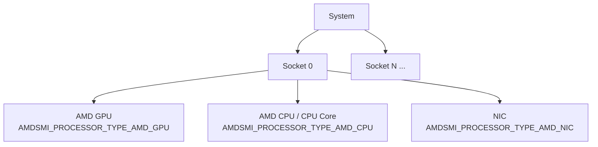
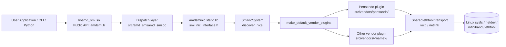

<!--
  Copyright (c) Advanced Micro Devices, Inc. All rights reserved.

  Permission is hereby granted, free of charge, to any person obtaining a copy
  of this software and associated documentation files (the "Software"), to deal
  in the Software without restriction, including without limitation the rights
  to use, copy, modify, merge, publish, distribute, sublicense, and/or sell
  copies of the Software, and to permit persons to whom the Software is
  furnished to do so, subject to the following conditions:

  The above copyright notice and this permission notice shall be included in
  all copies or substantial portions of the Software.

  THE SOFTWARE IS PROVIDED "AS IS", WITHOUT WARRANTY OF ANY KIND, EXPRESS OR
  IMPLIED, INCLUDING BUT NOT LIMITED TO THE WARRANTIES OF MERCHANTABILITY,
  FITNESS FOR A PARTICULAR PURPOSE AND NONINFRINGEMENT. IN NO EVENT SHALL THE
  AUTHORS OR COPYRIGHT HOLDERS BE LIABLE FOR ANY CLAIM, DAMAGES OR OTHER
  LIABILITY, WHETHER IN AN ACTION OF CONTRACT, TORT OR OTHERWISE, ARISING FROM,
  OUT OF OR IN CONNECTION WITH THE SOFTWARE OR THE USE OR OTHER DEALINGS IN
  THE SOFTWARE.
-->

# AMD SMI NIC integration guide

**Purpose**: This is a **contribution guide** for adding NIC device support to
the AMD SMI bare-metal (BM) library. It is *not* an end-user reference for the
`amd-smi` CLI or Python interface; it is intended for developers extending AMD
SMI with new NIC backends (AMD or third-party). This guide uses the in-tree
Pensando (ionic) plugin throughout as the worked example of the
vendor-integration pattern.

This document describes the AMD SMI public APIs, data structures, interfaces,
and conventions for integrating Network Interface Card (NIC) device support
into the [AMD SMI](https://github.com/ROCm/rocm-systems/tree/develop/projects/amdsmi)
framework.

**Scope**: This guide covers the **bare-metal (BM) AMD SMI** library only.
The Host AMD SMI library is a separate codebase with its own rules,
conventions, build system, and contribution process; the only components it
shares with the BM library are the public AMD SMI header (`amdsmi.h`, common
API subset) and the NIC library sources. Anything outside those two shared
components is BM-specific. For the host library, see:

- Source: [amd/MxGPU-Virtualization (`smi-lib`)](https://github.com/amd/MxGPU-Virtualization/tree/staging/smi-lib)
- User guide: [AMD SMI for virtualization (Instinct docs)](https://instinct.docs.amd.com/projects/amd-smi-virt/en/latest/)

AMD SMI provides a unified management interface for AMD accelerators (GPUs,
CPUs), and is extended to support NIC devices via its public C API. This
document covers:

- [Architecture and device model](#architecture)
- [Public API conventions and naming](#public-api-conventions)
- [Data structures and type definitions](#data-structures)
- [Device discovery and initialization](#public-api-reference)
- [NIC Information APIs](#nic-information-apis) (ASIC, bus, NUMA, ports, driver, firmware, RDMA, statistics, vendor statistics)
- [Sysfs data source mapping](#sysfs-data-source-reference)
- [Code organization and integration points](#code-organization)
- Example usage ([C](#example-querying-nic-information-c) and [Python](#example-querying-nic-information-python))
- [Vendor plugin integration pattern (with Pensando as reference)](#vendor-plugin-architecture)
- [CLI commands for NIC management](#amd-smi-cli-commands-for-nic)
- [Build configuration for NIC support](#build-system)

---

## Architecture

### Device model

AMD SMI uses a hierarchical device model:

```
System
└── Socket(s)
    └── Processor(s)
        ├── GPU    (AMDSMI_PROCESSOR_TYPE_AMD_GPU)
        ├── CPU    (AMDSMI_PROCESSOR_TYPE_AMD_CPU / _AMD_CPU_CORE)
        └── NIC    (AMDSMI_PROCESSOR_TYPE_AMD_NIC)
```

AMD SMI surfaces every discovered NIC, AMD or third-party, through the single
`AMDSMI_PROCESSOR_TYPE_AMD_NIC` processor type. The public API does not expose a
per-vendor processor type; vendor distinction is an implementation detail of the
NIC library's plugin layer (see
[Vendor plugin architecture](#vendor-plugin-architecture)).

Each NIC is represented as a **processor handle** (`amdsmi_processor_handle`).
You obtain handles from the standard AMD SMI discovery APIs, then pass them to
device-specific query functions.



### Processor types

The `amdsmi_processor_type_t` enum defines all device types detectable by AMD SMI.
The value relevant to NIC devices is:

```c
typedef enum {
    AMDSMI_PROCESSOR_TYPE_UNKNOWN = 0,   // Unknown processor type
    AMDSMI_PROCESSOR_TYPE_AMD_GPU,       // AMD GPU
    AMDSMI_PROCESSOR_TYPE_AMD_CPU,       // AMD CPU
    AMDSMI_PROCESSOR_TYPE_NON_AMD_GPU,   // Non-AMD GPU
    AMDSMI_PROCESSOR_TYPE_NON_AMD_CPU,   // Non-AMD CPU
    AMDSMI_PROCESSOR_TYPE_AMD_CPU_CORE,  // AMD CPU Core
    AMDSMI_PROCESSOR_TYPE_AMD_APU,       // AMD APU (GPU + CPU on a single die)
    AMDSMI_PROCESSOR_TYPE_AMD_NIC        // NIC (AMD or third-party)
} amdsmi_processor_type_t;
```

All NIC backends report their devices under `AMDSMI_PROCESSOR_TYPE_AMD_NIC`. A
new vendor does **not** add a processor-type value; it registers a discovery
plugin instead (see [Vendor plugin architecture](#vendor-plugin-architecture)).

### Initialization flags

To discover NIC devices, pass the `AMDSMI_INIT_AMD_NICS` flag during initialization:

```c
#define AMDSMI_INIT_AMD_NICS  (1 << 4)   // Initialize NIC discovery
```

:::{note}
You can also discover NIC devices by passing `AMDSMI_INIT_ALL_PROCESSORS`, or by
OR-ing `AMDSMI_INIT_AMD_NICS` with other initialization flags (for example,
`AMDSMI_INIT_AMD_NICS | AMDSMI_INIT_AMD_GPUS`). All registered vendor plugins
run during discovery regardless of vendor (see
[Vendor plugin architecture](#vendor-plugin-architecture)).
:::

### Vendor plugin architecture

NIC support lives in a self-contained static library, `amdsminic`, under
`src/nic/ai-nic/amdsmi_unified/`. That library exposes a vendor-neutral C
interface (`smi_nic_interface.h`) to the AMD SMI dispatch layer and, internally,
drives discovery through a set of **vendor plugins**. A plugin is a C++ class
that implements the `SmiNicSubsystem` interface and knows how to recognize and
enumerate one vendor's hardware.

**Key design points:**

1. **One registration point.** `make_default_vendor_plugins()` (in
   `src/vendors/vendor_registry.{h,cpp}`) returns one plugin instance per
   supported vendor. Adding a partner is a new `src/vendors/<name>/`
   subdirectory plus one `push_back` line in this function; nothing else in the
   core discovery path changes.

2. **Plugins implement `SmiNicSubsystem`.** The base interface
   (`inc/smi_nic_subsystem.h`) is:

   ```cpp
   class SmiNicSubsystem {
    public:
     virtual void discover(const std::string& pci_path, const std::string& net_path) = 0;
     virtual NicVendor vendor() const = 0;
     virtual bool driver_loaded(const std::string& bdf, DriverType driver_type) const = 0;
     virtual const std::vector<std::unique_ptr<SmiNic>>& get_nics() const = 0;

    protected:
     std::pair<uint16_t, uint16_t> read_pci_ids(const std::string& sysfs_bus_path) const;
     bool resolve_bdf(const std::string& symlink, std::string& bdf) const;
   };
   ```

   The protected helpers `read_pci_ids()` and `resolve_bdf()` are shared by every
   plugin so vendors don't reimplement sysfs PCI parsing.

3. **Discovery is id-match based.** `SmiNicSystem::discover_nics()`
   (`src/smi_nic_system.cpp`) walks `/sys/bus/pci/devices` and `/sys/class/net`
   and calls each registered plugin's `discover()`. A plugin scans the PCI path,
   uses `read_pci_ids()` to match its own `VENDOR_ID`/`DEVICE_ID`, builds a
   `SmiNic` for each match, then associates network ports with it. The system
   aggregates every plugin's `get_nics()` into one BDF-sorted list.

4. **Ports reuse the shared ethtool transport.** Port objects (`SmiNicPort`)
   already own a transport created via
   `create_transport(NicBackend_t::Auto)` (`inc/smi_nic_transport.h`). `Auto`
   tries the netlink backend first (kernel 5.6+ with libnl-3, built only when
   `HAVE_LIBNL3` is defined) and falls back to the ioctl backend. A plugin that
   builds on `SmiNic`/`SmiNicPort` inherits FEC, pause, link-settings, driver
   info, and ethtool statistics for free. It does not need to create a
   transport of its own.

5. **Public surface stays unified.** Plugins are internal to `amdsminic`. They
   do not add symbols to `amdsmi.h`; all access is through the standard
   `amdsmi_get_nic_*` APIs, which the dispatch layer forwards into the library's
   `smi_nic_*` C interface.

The reference plugin is Pensando/ionic
(`src/vendors/pensando/pensando_subsystem.{h,cpp}`):

```cpp
class SmiNicSubsystemPensando : public SmiNicSubsystem {
  // ...
 private:
  static constexpr uint16_t VENDOR_ID = 0x1dd8;
  static constexpr uint16_t DEVICE_ID = 0x0008;   // PCI bridge
  static constexpr uint16_t PORT_ID   = 0x1002;   // downstream port function
};
```

Its `discover()` matches `VENDOR_ID`/`DEVICE_ID` for the bridge, then
`discover_ports()` walks `/sys/class/net`, resolves each interface's PCI BDF,
matches `PORT_ID`, confirms the port is downstream of the bridge, and collects
InfiniBand/RDMA info and statistics on each accepted port.



---

## Public API conventions

### Naming

All public AMD SMI functions follow this pattern:

```
amdsmi_get_<device_type>_<data_category>(processor_handle, output_struct*)
```

Examples:
- `amdsmi_get_nic_asic_info()`
- `amdsmi_get_nic_bus_info()`
- `amdsmi_get_nic_port_info()`
- `amdsmi_get_nic_rdma_port_statistics()`

### Parameter conventions

| Parameter | Convention |
|-----------|-----------|
| `processor_handle` | Always the first parameter. Obtained from discovery APIs. |
| Output structs | Pointer to caller-allocated struct. Must not be `NULL`. |
| Two-call pattern | For variable-length data: first call with `data=NULL` returns count; second call fills the array. |

### Return values

All APIs return `amdsmi_status_t`:

| Status | Meaning |
|--------|---------|
| `AMDSMI_STATUS_SUCCESS` | Operation completed successfully |
| `AMDSMI_STATUS_INVAL` | Invalid argument (for example, `NULL` pointer) |
| `AMDSMI_STATUS_NOT_SUPPORTED` | Feature not supported on this device |
| `AMDSMI_STATUS_FILE_ERROR` | Failed to read sysfs file |
| `AMDSMI_STATUS_NO_PERM` | Insufficient permissions |
| `AMDSMI_STATUS_INIT_ERROR` | Library not initialized |
| `AMDSMI_STATUS_BUSY` | Device mutex could not be acquired |

### Unsupported or unavailable fields

When a device or driver does not provide a value for a particular field within
a larger output struct, AMD SMI uses the following conventions instead of
failing the entire call:

| Field type | Sentinel value for unsupported / unavailable |
|------------|----------------------------------------------|
| Unsigned integers (`uint8_t`, `uint16_t`, `uint32_t`, `uint64_t`) | The maximum value of the type (for example, `UINT32_MAX`, `UINT64_MAX`) |
| Signed integers | `INT32_MIN` / `INT64_MIN` |
| Floating-point | `NaN` |
| Strings (`char[]`) | The literal string `"N/A"`, or an empty string (`""`) when the field is structurally absent |
| Bitmask / flag fields | `0` (no flags set) |

Treat these sentinel values as "not reported" rather than as valid data. The
overall API call still returns `AMDSMI_STATUS_SUCCESS` provided at least one
field in the struct was populated; per-field availability is encoded via the
sentinels above. If *no* field can be populated, the API returns
`AMDSMI_STATUS_NOT_SUPPORTED`.

---

## Data structures

### Size constants

```c
#define AMDSMI_MAX_STRING_LENGTH       256  // Max string buffer length
#define AMDSMI_MAX_NIC_PORTS            32  // Max NIC ports
#define AMDSMI_MAX_NIC_RDMA_DEV         32  // Max RDMA devices
```

### NIC ASIC information

```c
typedef struct {
    uint16_t vendor_id;
    uint16_t subvendor_id;
    uint16_t device_id;
    uint16_t subsystem_id;
    uint8_t  revision;
    char     permanent_address[AMDSMI_MAX_STRING_LENGTH];
    char     product_name[AMDSMI_MAX_STRING_LENGTH];
    char     part_number[AMDSMI_MAX_STRING_LENGTH];
    char     serial_number[AMDSMI_MAX_STRING_LENGTH];
    char     vendor_name[AMDSMI_MAX_STRING_LENGTH];
} amdsmi_nic_asic_info_t;
```

**Sysfs sources:**
- `vendor_id`: `/sys/bus/pci/devices/<BDF>/vendor`
- `device_id`: `/sys/bus/pci/devices/<BDF>/device`
- `subvendor_id`: `/sys/bus/pci/devices/<BDF>/subsystem_vendor`
- `subsystem_id`: `/sys/bus/pci/devices/<BDF>/subsystem_device`
- `revision`: `/sys/bus/pci/devices/<BDF>/revision`
- `product_name`, `part_number`, `serial_number`: VPD data, read from `/sys/bus/pci/devices/<BDF>/vpd` when present. Devices that do not expose the sysfs VPD entry report these fields as unavailable.

### NIC bus information

```c
typedef struct {
    amdsmi_bdf_t bdf;
    uint8_t  max_pcie_width;
    uint32_t max_pcie_speed;  // in GT/s
    char     pcie_interface_version[AMDSMI_MAX_STRING_LENGTH];
    char     slot_type[AMDSMI_MAX_STRING_LENGTH];
} amdsmi_nic_bus_info_t;
```

**Sysfs sources:**
- `bdf`: Parsed from PCI enumeration
- `max_pcie_width`: `/sys/bus/pci/devices/<BDF>/max_link_width`
- `max_pcie_speed`: `/sys/bus/pci/devices/<BDF>/max_link_speed`

### BDF (Bus-Device-Function)

`amdsmi_bdf_t` is a union that provides three ways to access the BDF:

```c
typedef union {
    struct bdf_ {
        uint64_t function_number : 3;
        uint64_t device_number   : 5;
        uint64_t bus_number      : 8;
        uint64_t domain_number   : 48;
    } bdf;
    struct {  // anonymous access (same layout)
        uint64_t function_number : 3;
        uint64_t device_number   : 5;
        uint64_t bus_number      : 8;
        uint64_t domain_number   : 48;
    };
    uint64_t as_uint;  // raw 64-bit value
} amdsmi_bdf_t;
```

Fields can be accessed directly (for example, `bdf.function_number`) or via the
named struct (for example, `bdf.bdf.function_number`). The `as_uint` member
provides the packed 64-bit representation.

### NIC NUMA information

```c
typedef struct {
    uint8_t node;
    char    affinity[AMDSMI_MAX_STRING_LENGTH];
} amdsmi_nic_numa_info_t;
```

**Sysfs sources:**
- `node`: `/sys/bus/pci/devices/<BDF>/numa_node`
- `affinity`: `/sys/devices/system/node/node<N>/cpulist` (where `<N>` is the value read from `numa_node`)

### NIC port information

```c
typedef struct {
    amdsmi_bdf_t bdf;
    uint32_t port_num;
    char     type[AMDSMI_MAX_STRING_LENGTH];
    char     flavour[AMDSMI_MAX_STRING_LENGTH];
    char     netdev[AMDSMI_MAX_STRING_LENGTH];
    uint32_t ifindex;
    char     mac_address[AMDSMI_MAX_STRING_LENGTH];
    uint8_t  carrier;
    uint16_t mtu;
    char     link_state[AMDSMI_MAX_STRING_LENGTH];
    uint32_t link_speed;
    uint32_t active_fec;   // Active FEC modes bitmask
    char     autoneg[AMDSMI_MAX_STRING_LENGTH];
    char     pause_autoneg[AMDSMI_MAX_STRING_LENGTH];
    char     pause_rx[AMDSMI_MAX_STRING_LENGTH];
    char     pause_tx[AMDSMI_MAX_STRING_LENGTH];
} amdsmi_nic_port_t;

typedef struct {
    uint32_t        num_ports;
    amdsmi_nic_port_t ports[AMDSMI_MAX_NIC_PORTS];
} amdsmi_nic_port_info_t;
```

The port fields sourced from ethtool (`active_fec`, the `pause_*` fields, and
`link_speed`) are populated through the shared transport layer described in
[Vendor plugin architecture](#vendor-plugin-architecture).

**Active FEC bitmask values** (example mapping from `ethtool_fecparam`):

:::{note}
The values below are a representative example. The exact bit values and the set
of supported modes may differ between Linux kernel and `ethtool` versions. Refer
to the `ethtool_fecparam` definitions in the kernel UAPI headers
(`<linux/ethtool.h>`) of the target system rather than treating the table below
as a fixed contract.
:::

| Value | Mode |
|-------|------|
| 0x01 | `ETHTOOL_FEC_NONE` |
| 0x02 | `ETHTOOL_FEC_AUTO` |
| 0x04 | `ETHTOOL_FEC_RS` |
| 0x08 | `ETHTOOL_FEC_BASER` |
| 0x10 | `ETHTOOL_FEC_LLRS` |
| 0x20 | `ETHTOOL_FEC_OFF` |

### NIC driver information

```c
typedef struct {
    char name[AMDSMI_MAX_STRING_LENGTH];
    char version[AMDSMI_MAX_STRING_LENGTH];
} amdsmi_nic_driver_info_t;
```

### NIC firmware information

```c
typedef struct {
    char name[AMDSMI_MAX_STRING_LENGTH];
    char version[AMDSMI_MAX_STRING_LENGTH];
} amdsmi_nic_fw_t;

typedef struct {
    uint32_t        num_fw;
    amdsmi_nic_fw_t fw[AMDSMI_MAX_NIC_FW];
} amdsmi_nic_fw_info_t;
```

### NIC RDMA device information

```c
typedef struct {
    char    netdev[AMDSMI_MAX_STRING_LENGTH];
    char    state[AMDSMI_MAX_STRING_LENGTH];
    uint8_t rdma_port;
    uint16_t max_mtu;
    uint16_t active_mtu;
} amdsmi_nic_rdma_port_info_t;

typedef struct {
    char    rdma_dev[AMDSMI_MAX_STRING_LENGTH];
    char    node_guid[AMDSMI_MAX_STRING_LENGTH];
    char    node_type[AMDSMI_MAX_STRING_LENGTH];
    char    sys_image_guid[AMDSMI_MAX_STRING_LENGTH];
    char    fw_ver[AMDSMI_MAX_STRING_LENGTH];
    uint8_t num_rdma_ports;
    amdsmi_nic_rdma_port_info_t rdma_port_info[AMDSMI_MAX_NIC_PORTS];
} amdsmi_nic_rdma_dev_info_t;

typedef struct {
    uint8_t num_rdma_dev;
    amdsmi_nic_rdma_dev_info_t rdma_dev_info[AMDSMI_MAX_NIC_RDMA_DEV];
} amdsmi_nic_rdma_devices_info_t;
```

### NIC statistics

```c
typedef struct {
    char     name[AMDSMI_MAX_STRING_LENGTH];
    uint64_t value;
} amdsmi_nic_stat_t;
```

Used by `amdsmi_get_nic_rdma_port_statistics()`,
`amdsmi_get_nic_port_statistics()`, and `amdsmi_get_nic_vendor_statistics()`.

---

## Public API reference

The canonical reference for every AMD SMI public API is the header
[`projects/amdsmi/include/amd_smi/amdsmi.h`](../../include/amd_smi/amdsmi.h)
and the rendered Sphinx documentation at the
[AMD SMI documentation](https://rocm.docs.amd.com/projects/amdsmi/en/latest/).
For an end-to-end usage example, see
[`amd_smi_nic.cc`](../../example/amd_smi_nic.cc). The summaries below provide a
NIC-focused subset of that reference; use the header and the in-tree example as
the source of truth.

:::{note}
The signatures listed in this section reflect the **bare-metal (BM) AMD SMI**
library. The host AMD SMI library is a separate codebase with its own user
guide; see
[amd/MxGPU-Virtualization (`smi-lib`)](https://github.com/amd/MxGPU-Virtualization/tree/staging/smi-lib)
and the
[AMD SMI for virtualization user guide](https://instinct.docs.amd.com/projects/amd-smi-virt/en/latest/).
:::

### Initialization and shutdown

```c
// Initialize AMD SMI with NIC support
amdsmi_status_t amdsmi_init(uint64_t init_flags);
// Use: amdsmi_init(AMDSMI_INIT_AMD_NICS);

// Shutdown AMD SMI
amdsmi_status_t amdsmi_shut_down(void);
```

### Device discovery

```c
// Get socket handles
amdsmi_status_t amdsmi_get_socket_handles(uint32_t *socket_count,
                                          amdsmi_socket_handle *socket_handles);

// Get processor handles filtered by type
amdsmi_status_t amdsmi_get_processor_handles_by_type(
    amdsmi_socket_handle socket_handle,
    amdsmi_processor_type_t processor_type,
    amdsmi_processor_handle *processor_handles,
    uint32_t *processor_count);
```

NIC handles are requested with `processor_type = AMDSMI_PROCESSOR_TYPE_AMD_NIC`.

**Two-call pattern for discovery:**

1. Call with `processor_handles = NULL` to get `processor_count`.
2. Allocate an array of `processor_count` handles.
3. Call again with the allocated array.

### NIC information APIs

The following APIs are implemented and available in the current AMD SMI release:

```c
// NIC ASIC Information
amdsmi_status_t amdsmi_get_nic_asic_info(
    amdsmi_processor_handle processor_handle,
    amdsmi_nic_asic_info_t *info);

// NIC Bus Information
amdsmi_status_t amdsmi_get_nic_bus_info(
    amdsmi_processor_handle processor_handle,
    amdsmi_nic_bus_info_t *info);

// NIC NUMA Information
amdsmi_status_t amdsmi_get_nic_numa_info(
    amdsmi_processor_handle processor_handle,
    amdsmi_nic_numa_info_t *info);

// NIC Driver Information
amdsmi_status_t amdsmi_get_nic_driver_info(
    amdsmi_processor_handle processor_handle,
    amdsmi_nic_driver_info_t *info);

// NIC Firmware Information
amdsmi_status_t amdsmi_get_nic_fw_info(
    amdsmi_processor_handle processor_handle,
    amdsmi_nic_fw_info_t *info);

// NIC Port Information
amdsmi_status_t amdsmi_get_nic_port_info(
    amdsmi_processor_handle processor_handle,
    amdsmi_nic_port_info_t *info);

// NIC RDMA Device Information
amdsmi_status_t amdsmi_get_nic_rdma_dev_info(
    amdsmi_processor_handle processor_handle,
    amdsmi_nic_rdma_devices_info_t *info);
```

### NIC RDMA port statistics

This API uses a **two-call pattern**:

```c
amdsmi_status_t amdsmi_get_nic_rdma_port_statistics(
    amdsmi_processor_handle processor_handle,
    uint32_t rdma_port_index,
    uint32_t *num_stats,
    amdsmi_nic_stat_t *stats);
```

**Usage:**

1. Call with `stats = NULL` to get `num_stats` (count of available statistics).
2. Allocate an array of `num_stats` elements.
3. Call again with the allocated array.

### NIC port statistics and vendor statistics

Both APIs use a **two-call pattern** and return per-port counters. Port
statistics are the standard driver counters for a NIC port; vendor statistics
are the driver-defined counters exposed via `ethtool -S`.

```c
amdsmi_status_t amdsmi_get_nic_port_statistics(
    amdsmi_processor_handle processor_handle,
    uint32_t port_index,
    uint32_t *num_stats,
    amdsmi_nic_stat_t *stats);

amdsmi_status_t amdsmi_get_nic_vendor_statistics(
    amdsmi_processor_handle processor_handle,
    uint32_t port_index,
    uint32_t *num_stats,
    amdsmi_nic_stat_t *stats);
```

**Usage:**

1. Call with `stats = NULL` to get `num_stats` (count of available statistics for the port).
2. Allocate an array of `num_stats` elements.
3. Call again with the allocated array.

---

## Vendor plugin implementation

This section is for contributors working on the NIC library itself. Public
consumers should use the `amdsmi_*` API described above; they never see the
internal C interface or the C++ plugin classes discussed here.

### Internal C interface (`smi_nic_interface.h`)

The `amdsminic` static library exposes a vendor-neutral C interface,
`include/amd_smi/impl/nic/amdsmi_unified/interface/smi_nic_interface.h`, that the
AMD SMI dispatch layer (`src/amd_smi/amd_smi.cc`) calls. It is context-based:

```c
smi_nic_status_t smi_nic_create_context(smi_nic_ctx_t* ctx);
smi_nic_status_t smi_nic_destroy_context(smi_nic_ctx_t ctx);
smi_nic_status_t smi_discover_nics(smi_nic_ctx_t ctx, smi_nic_discovery_t* discovery);

smi_nic_status_t smi_get_nic_asic_info(smi_nic_ctx_t ctx, uint64_t device,
                                       smi_nic_asic_info_t* info);
smi_nic_status_t smi_get_nic_bus_info(smi_nic_ctx_t ctx, uint64_t device,
                                      smi_nic_bus_info_t* info);
// ...and the remaining smi_get_nic_* queries.
```

`smi_nic_status_t` and the `smi_nic_*` structures are **internal to the NIC
library**. The dispatch layer converts them to `amdsmi_status_t` and the
`amdsmi_nic_*` structures at the public boundary; none of the `smi_nic_*` types
appear in `amdsmi.h`.

### C++ plugin layer

Behind the C interface, `SmiNicSystem` (`src/smi_nic_system.cpp`) drives
discovery through the vendor plugins:

- Its constructor calls `make_default_vendor_plugins()` and registers each
  returned `SmiNicSubsystem`.
- `discover_nics()` iterates the registered plugins, calling
  `discover("/sys/bus/pci/devices", "/sys/class/net")` on each and collecting
  their `get_nics()` into one BDF-sorted list.
- `driver_loaded()` routes a query to the plugin whose `vendor()` matches the
  NIC that owns the BDF.

The Pensando plugin (`src/vendors/pensando/`) is the reference implementation.
It matches its PCI IDs during `discover()`, walks `/sys/class/net` in
`discover_ports()` to associate ports with the device, and implements
`driver_loaded()` for the `ionic` and `ionic_rdma` drivers.

### Device discovery details (Pensando reference)

| Step | Mechanism |
|------|-----------|
| Bridge match | Scan `/sys/bus/pci/devices`; `read_pci_ids()` must equal `VENDOR_ID`/`DEVICE_ID`. |
| Port match | Walk `/sys/class/net`; `resolve_bdf()` on each `<iface>/device`; `read_pci_ids()` must equal `VENDOR_ID`/`PORT_ID`. |
| Downstream check | Confirm the port BDF resolves under the bridge BDF via the sysfs symlink path. |
| Driver presence | `driver_loaded()` checks `/sys/bus/pci/drivers/ionic` and `/sys/bus/auxiliary/drivers/ionic_rdma.rdma`. |

The vendor's kernel driver must be loaded for its ports to appear under
`/sys/class/net`; without it, no ports are discovered for that device.

---

## AMD SMI CLI commands for NIC

The `amd-smi` CLI enumerates every NIC the library discovers through the same
public discovery path used above. There is no per-vendor CLI code. NIC-capable
subcommands accept a device selector:

```
-N, --nic <ID | BDF | UUID> ...
```

`amd-smi list` includes discovered NICs alongside GPUs, and `amd-smi static`
reports NIC identity details (BDF, product name, part/serial number, vendor)
when a NIC is selected with `-N/--nic`. NIC metrics are not yet surfaced through
`amd-smi metric`: telemetry stays internal to the library and isn't yet exposed
through the public API the CLI consumes. The selector works only when you
initialize NIC discovery (see [Initialization flags](#initialization-flags)).

---

## Sysfs data source reference

### Base paths

| Type | Base Path |
|------|-----------|
| PCI device | `/sys/bus/pci/devices/<BDF>/` |
| Network interface | `/sys/class/net/<iface>/device/` |
| InfiniBand / RDMA | `/sys/class/infiniband/<dev>/ports/<N>/` |
| PCI power runtime | `/sys/bus/pci/devices/<BDF>/power/` |

### NIC sysfs mapping

| Data Category | Sysfs Files |
|--------------|-------------|
| PCI Device Info | `vendor`, `device`, `subsystem_vendor`, `subsystem_device`, `revision`, `class`, `modalias`, `reset_method` |
| PCIe Link | `current_link_speed`, `max_link_speed`, `current_link_width`, `max_link_width` |
| DMA | `dma_mask_bits`, `consistent_dma_mask_bits` |
| Interrupt | `irq`, `msi_bus` |
| AER Errors | `aer_dev_correctable`, `aer_dev_fatal`, `aer_dev_nonfatal` |
| SR-IOV | `sriov_numvfs`, `sriov_totalvfs`, `sriov_offset`, `sriov_stride`, `sriov_vf_device`, `sriov_vf_total_msix`, `sriov_drivers_autoprobe` |
| ARI | `ari_enabled` |
| PCI Power State | `power_state`, `d3cold_allowed`, `broken_parity_status` |
| Power Runtime | `power/control`, `power/runtime_status`, `power/runtime_active_time`, `power/runtime_suspended_time`, `power/runtime_usage`, `power/runtime_enabled` |
| NUMA | `numa_node` |
| CPU Affinity | `/sys/devices/system/node/node<N>/cpulist` |
| Network port | `/sys/class/net/<iface>/` (`address`, `mtu`, `carrier`, `operstate`, `speed`, `dev_port`, `ifindex`, `type`) |
| RDMA | `/sys/class/infiniband/<dev>/` (`node_guid`, `node_type`, `sys_image_guid`, `fw_ver`, `ports/<N>/state`, `ports/<N>/counters/*`) |
| VPD Data | `/sys/bus/pci/devices/<BDF>/vpd` when present (product name, part number, serial number) |

---

## Code organization

**Scope**: The directory layout below describes the **bare-metal (BM) AMD SMI**
build under ROCm, which is the focus of this contribution guide. The Host AMD
SMI library is a **separate codebase** with its own rules, conventions, and
build system (see
[amd/MxGPU-Virtualization (`smi-lib`)](https://github.com/amd/MxGPU-Virtualization/tree/staging/smi-lib)
and the
[AMD SMI for virtualization user guide](https://instinct.docs.amd.com/projects/amd-smi-virt/en/latest/)).
The only components shared between the two are:

- the **public header** `include/amd_smi/amdsmi.h` (the common API subset), and
- the **NIC library** sources under `src/nic/` (and its interface headers under
  `include/amd_smi/impl/nic/`).

When modifying the NIC library or the public header, keep in mind that those
changes are consumed by both the BM build and the host build and must remain
compatible across them. Anything outside the two shared components above is
BM-specific.

The AMD SMI NIC implementation (BM build) follows this directory structure:

```
projects/amdsmi/
├── include/amd_smi/
│   ├── amdsmi.h                              # Public API header (structs + function declarations)
│   └── impl/
│       ├── amd_smi_common.h                  # Internal common definitions
│       ├── amd_smi_utils.h                   # Utility functions (sysfs readers, helpers)
│       └── nic/amdsmi_unified/interface/
│           └── smi_nic_interface.h           # Internal C interface consumed by the dispatch layer
├── src/
│   ├── amd_smi/
│   │   ├── amd_smi.cc                        # Public API implementation (dispatch layer)
│   │   ├── amd_smi_system.cc                 # System-level init, device discovery
│   │   └── amd_smi_utils.cc                  # Sysfs reading utilities
│   └── nic/ai-nic/amdsmi_unified/            # amdsminic static library
│       ├── CMakeLists.txt                    # Globs src/*.cpp, vendors/*.cpp, vendors/*/*.cpp
│       ├── inc/                              # Internal headers
│       │   ├── smi_nic.h                     # SmiNic / SmiNicPort / SmiInfiniBand
│       │   ├── smi_nic_subsystem.h           # SmiNicSubsystem base interface + shared helpers
│       │   ├── smi_nic_system.h              # SmiNicSystem
│       │   ├── smi_nic_transport.h           # NicTransport + create_transport() factory
│       │   ├── smi_ethtool_ioctl.h           # ethtool ioctl helpers (ioctl transport)
│       │   ├── smi_devlink_netlink.h         # devlink-over-netlink helpers
│       │   ├── netlink_wrapper.h             # NLSocket / NLMessage (libnl-3 RAII wrappers)
│       │   ├── netlink_generic.h             # GenericNetlinkClient (generic netlink)
│       │   ├── netlink_ethtool.h             # EthtoolNetlinkClient (ethtool over netlink)
│       │   └── smi_sysfs.h                   # Sysfs readers
│       └── src/
│           ├── smi_nic.cpp                   # SmiNic / SmiNicPort (owns the Auto transport)
│           ├── smi_nic_system.cpp            # SmiNicSystem::discover_nics()
│           ├── smi_nic_subsystem.cpp         # read_pci_ids() / resolve_bdf() helpers
│           ├── smi_nic_interface.cpp         # C interface implementation
│           ├── smi_nic_transport_ioctl.cpp   # ioctl transport backend + create_transport() factory
│           ├── smi_nic_transport_netlink.cpp # netlink transport backend (built when HAVE_LIBNL3)
│           ├── smi_ethtool_ioctl.cpp         # ethtool ioctl backend
│           ├── smi_devlink_netlink.cpp       # devlink-over-netlink backend
│           ├── netlink_wrapper.cpp           # libnl-3 socket/message wrappers
│           ├── netlink_generic.cpp           # generic netlink (genl) client
│           ├── netlink_ethtool.cpp           # ethtool-over-netlink client
│           ├── smi_sysfs.cpp
│           └── vendors/
│               ├── vendor_registry.{h,cpp}   # make_default_vendor_plugins()
│               ├── pensando/
│               │   └── pensando_subsystem.{h,cpp}  # Reference vendor plugin (registered)
│               └── broadcom/
│                   └── broadcom_subsystem.{h,cpp}  # Broadcom plugin (compiled; not yet registered)
├── py-interface/
│   ├── amdsmi_interface.py                   # Python wrapper (high-level, public AMD SMI API only)
│   └── amdsmi_wrapper.py                     # Python ctypes bindings to amdsmi.h (auto-generated)
├── amdsmi_cli/
│   ├── amdsmi_commands.py                    # Unified CLI command implementations
│   └── amdsmi_parser.py                      # CLI argument parsing
└── example/
    └── amd_smi_nic.cc                        # NIC C++ example (public AMD SMI API)
```

### Key integration points

1. **Public header** (`include/amd_smi/amdsmi.h`): All public NIC structs and
   API declarations. New NIC functionality is exposed here through unified
   `amdsmi_get_nic_*` APIs. Vendor plugins do **not** add symbols here.

2. **Dispatch layer** (`src/amd_smi/amd_smi.cc`): Routes public `amdsmi_get_nic_*`
   calls into the `amdsminic` library's `smi_nic_*` C interface and converts the
   library's status codes and structures to their `amdsmi_*` equivalents at the
   boundary.

3. **NIC library C interface**
   (`include/amd_smi/impl/nic/amdsmi_unified/interface/smi_nic_interface.h`):
   The vendor-neutral, context-based C API that the dispatch layer consumes.

4. **Discovery and plugins** (`src/nic/ai-nic/amdsmi_unified/`): `SmiNicSystem`
   drives discovery via `make_default_vendor_plugins()`; each plugin implements
   `SmiNicSubsystem`. This is where a new vendor is added.

5. **Shared transport** (`inc/smi_nic_transport.h`,
   `src/smi_nic_transport_{ioctl,netlink}.cpp`): The ethtool transport used by
   `SmiNicPort`. `create_transport()` selects the backend
   (`NicBackend_t::{Auto, Ioctl, Netlink}`).

6. **Python interface** (`py-interface/amdsmi_interface.py`,
   `py-interface/amdsmi_wrapper.py`): Bindings to the public `amdsmi.h` only. A
   new backend is reachable from Python as soon as it is reachable from C; no
   per-vendor Python module is needed.

7. **CLI** (`amdsmi_cli/amdsmi_commands.py`): Enumerates every NIC through the
   public discovery API; no per-vendor delegation class.

8. **Example** (`example/amd_smi_nic.cc`): Uses the public AMD SMI API and
   exercises every NIC backend.

---

(example-querying-nic-information-c)=
## Example: Querying NIC information \(C)

A complete, build-tested C/C++ example for querying NIC ASIC, bus, NUMA,
port, and RDMA statistics is maintained in the repository at
[projects/amdsmi/example/amd_smi_nic.cc](../../example/amd_smi_nic.cc). It is
compiled as part of the `BUILD_EXAMPLES=ON` CMake target.

The abbreviated snippet below illustrates the canonical init → discover →
query → shutdown flow. See that file for the full implementation, including
error handling and all supported queries.

```c
#include <amd_smi/amdsmi.h>
#include <stdio.h>
#include <stdlib.h>
#include <inttypes.h>

int main() {
    amdsmi_status_t status;

    // Initialize with NIC support (use AMDSMI_INIT_ALL_PROCESSORS to also
    // include GPUs and CPUs in the same process).
    status = amdsmi_init(AMDSMI_INIT_AMD_NICS);
    if (status != AMDSMI_STATUS_SUCCESS) {
        fprintf(stderr, "Failed to initialize AMD SMI: %d\n", status);
        return 1;
    }

    // Discover sockets
    uint32_t socket_count = 0;
    status = amdsmi_get_socket_handles(&socket_count, NULL);
    amdsmi_socket_handle *sockets = malloc(socket_count * sizeof(amdsmi_socket_handle));
    status = amdsmi_get_socket_handles(&socket_count, sockets);

    // Discover NIC processors
    for (uint32_t s = 0; s < socket_count; s++) {
        uint32_t nic_count = 0;
        status = amdsmi_get_processor_handles_by_type(
            sockets[s], AMDSMI_PROCESSOR_TYPE_AMD_NIC, NULL, &nic_count);

        amdsmi_processor_handle *nic_handles = malloc(nic_count * sizeof(amdsmi_processor_handle));
        status = amdsmi_get_processor_handles_by_type(
            sockets[s], AMDSMI_PROCESSOR_TYPE_AMD_NIC, nic_handles, &nic_count);

        for (uint32_t n = 0; n < nic_count; n++) {
            // Query ASIC info
            amdsmi_nic_asic_info_t asic = {0};
            status = amdsmi_get_nic_asic_info(nic_handles[n], &asic);
            if (status == AMDSMI_STATUS_SUCCESS) {
                printf("NIC %u:\n", n);
                printf("  Vendor ID:    0x%04x\n", asic.vendor_id);
                printf("  Device ID:    0x%04x\n", asic.device_id);
                printf("  Product:      %s\n", asic.product_name);
                printf("  Part Number:  %s\n", asic.part_number);
                printf("  Serial:       %s\n", asic.serial_number);
            }

            // Query Bus info
            amdsmi_nic_bus_info_t bus = {0};
            status = amdsmi_get_nic_bus_info(nic_handles[n], &bus);
            if (status == AMDSMI_STATUS_SUCCESS) {
                printf("  BDF:          %04lx:%02x:%02x.%lx\n",
                    (unsigned long)bus.bdf.domain_number,
                    (unsigned)bus.bdf.bus_number,
                    (unsigned)bus.bdf.device_number,
                    (unsigned long)bus.bdf.function_number);
                printf("  Max PCIe Width: %u\n", bus.max_pcie_width);
                printf("  Max PCIe Speed: %u GT/s\n", bus.max_pcie_speed);
            }

            // Query NUMA info
            amdsmi_nic_numa_info_t numa = {0};
            status = amdsmi_get_nic_numa_info(nic_handles[n], &numa);
            if (status == AMDSMI_STATUS_SUCCESS) {
                printf("  NUMA Node:    %u\n", numa.node);
                printf("  CPU Affinity: %s\n", numa.affinity);
            }

            // Query Port info
            amdsmi_nic_port_info_t ports = {0};
            status = amdsmi_get_nic_port_info(nic_handles[n], &ports);
            if (status == AMDSMI_STATUS_SUCCESS) {
                for (uint32_t p = 0; p < ports.num_ports; p++) {
                    printf("  Port %u:\n", p);
                    printf("    Netdev:     %s\n", ports.ports[p].netdev);
                    printf("    MAC:        %s\n", ports.ports[p].mac_address);
                    printf("    Link State: %s\n", ports.ports[p].link_state);
                    printf("    Link Speed: %u Mb/s\n", ports.ports[p].link_speed);
                    printf("    MTU:        %u\n", ports.ports[p].mtu);
                }
            }

            // Query RDMA port statistics (two-call pattern)
            uint32_t num_stats = 0;
            status = amdsmi_get_nic_rdma_port_statistics(
                nic_handles[n], 0, &num_stats, NULL);
            if (status == AMDSMI_STATUS_SUCCESS && num_stats > 0) {
                amdsmi_nic_stat_t *stats = malloc(num_stats * sizeof(amdsmi_nic_stat_t));
                status = amdsmi_get_nic_rdma_port_statistics(
                    nic_handles[n], 0, &num_stats, stats);
                if (status == AMDSMI_STATUS_SUCCESS) {
                    printf("  RDMA Port 0 Statistics (%u):\n", num_stats);
                    for (uint32_t i = 0; i < num_stats; i++) {
                        printf("    %s = %" PRIu64 "\n", stats[i].name, stats[i].value);
                    }
                }
                free(stats);
            }
        }
        free(nic_handles);
    }

    free(sockets);
    amdsmi_shut_down();
    return 0;
}
```

(example-querying-nic-information-python)=
## Example: Querying NIC information (Python)

```python
import amdsmi

# Initialize with NIC support
amdsmi.amdsmi_init(amdsmi.AmdSmiInitFlags.INIT_AMD_NICS)

try:
    # Discover sockets
    sockets = amdsmi.amdsmi_get_socket_handles()

    for socket in sockets:
        # Discover NIC processors
        nic_handles = amdsmi.amdsmi_get_processor_handles_by_type(
            socket, amdsmi.AmdSmiProcessorType.AMD_AINIC
        )

        for idx, nic in enumerate(nic_handles):
            # Summary info: BDF, product name, part/serial number, vendor
            info = amdsmi.amdsmi_get_ainic_info(nic)
            print(f"NIC {idx}:")
            print(f"  BDF:           {info['bdf']}")
            print(f"  Product Name:  {info['Product Name']}")
            print(f"  Part Number:   {info['Part Number']}")
            print(f"  Serial Number: {info['Serial Number']}")
            print(f"  Vendor Name:   {info['Vendor Name']}")

            # Detailed info: pass detail=True for the full nested dict (ASIC IDs, etc.)
            detail = amdsmi.amdsmi_get_ainic_info(nic, detail=True)
            asic = detail["ASIC"]
            print(f"  Vendor ID:     {asic['VENDOR_ID']}")
            print(f"  Device ID:     {asic['DEVICE_ID']}")
            print(f"  Revision:      {asic['REVISION']}")

            # Firmware versions (name -> version)
            fw = amdsmi.amdsmi_get_nic_fw_info(nic)
            for name, version in fw.items():
                print(f"  FW {name}: {version}")
finally:
    amdsmi.amdsmi_shut_down()
```

---

## Integration guidelines for external contributors

### Adding a new NIC vendor

Adding support for a new NIC vendor means adding a discovery plugin to the
`amdsminic` library. The public API surface does not change: your devices are
reported under `AMDSMI_PROCESSOR_TYPE_AMD_NIC` and queried through the existing
`amdsmi_get_nic_*` APIs.

1. **Create the plugin sources** under
   `src/nic/ai-nic/amdsmi_unified/src/vendors/<name>/`:
   - Add `<name>_subsystem.{h,cpp}` with a class that derives from
     `SmiNicSubsystem` (`inc/smi_nic_subsystem.h`) and implements `discover()`,
     `vendor()`, `driver_loaded()`, and `get_nics()`.
   - Match your hardware by PCI vendor/device ID in `discover()` using the
     inherited `read_pci_ids()` helper; use `resolve_bdf()` to map a network
     interface back to its PCI BDF. Follow `vendors/pensando/` as the model.
   - Build your NIC and port objects on `SmiNic`/`SmiNicPort` so you inherit the
     shared ethtool transport (FEC, pause, link settings, driver info,
     statistics) and sysfs readers. The default `create_transport(Auto)` backend
     already used by `SmiNicPort` needs no per-vendor setup.

2. **Register the plugin** in
   `src/nic/ai-nic/amdsmi_unified/src/vendors/vendor_registry.cpp`:
   - `#include "<name>/<name>_subsystem.h"`.
   - Add one `plugins.push_back(std::make_unique<SmiNicSubsystem<Name>>());`
     line inside `make_default_vendor_plugins()`.

3. **Re-run CMake.** `CMakeLists.txt` globs `vendors/*.cpp` and `vendors/*/*.cpp`
   without `CONFIGURE_DEPENDS`, so a new subdirectory is only picked up on a
   fresh configure. Re-run `cmake` (do not rely on an incremental `make`) after
   adding the directory.

4. **CLI and Python**: No changes needed. The unified CLI and the Python
   bindings reach your devices through the public discovery API as soon as the
   plugin is registered.

5. **Tests**: Add functional tests under `tests/`.

### Data source strategy

The following rules govern *where* a backend should read its data from. They
are the single most important guideline for keeping the public API surface
generic across vendors.

1. **sysfs first, for everything common.** Read all metrics, identifiers,
   link state, AER counters, SR-IOV state, power-runtime state, and any other
   attribute exposed by the standard Linux PCI, netdev, or RDMA subsystems from
   sysfs:
   - `/sys/bus/pci/devices/<BDF>/...`
   - `/sys/class/net/<iface>/...`
   - `/sys/class/infiniband/<dev>/ports/<N>/...`

   Backends must use sysfs (via the shared `smi_sysfs` readers) as the source
   for any field that sysfs exposes.

2. **ethtool via the shared transport.** For FEC, pause, link settings, driver
   info, and driver statistics, use the transport layer (`NicTransport`,
   obtained from `create_transport()`) rather than shelling out to `ethtool`.
   The `Auto` backend uses netlink where available and falls back to ioctl.

3. **VPD via sysfs `vpd`.**
   Parse product name, part number, and serial number from
   `/sys/bus/pci/devices/<BDF>/vpd` when the binary VPD blob is exposed. When a
   device does not expose the sysfs VPD entry, these fields are reported as
   unavailable. Backends must not shell out to external tools for VPD.

4. **Vendor RPC, only for vendor-specific data.** A backend may use a vendor
   ioctl, netlink, or library call **only** when the needed data is not
   available via sysfs or the shared transport. Keep such code inside the
   plugin's `vendors/<name>/` files and don't leak vendor types into the public
   header or the `smi_nic_interface.h` C interface.

5. **No synthesized data.** If a source doesn't exist for a given device, return
   the documented "unsupported" sentinel (see
   [Unsupported or unavailable fields](#unsupported-or-unavailable-fields)) or
   omit the entry from the variable-length list; never substitute zero.

### Key principles

- **Use standard AMD SMI naming conventions**: `amdsmi_get_nic_*()`.
- **All output structs are caller-allocated**: You allocate the struct and pass a pointer.
- **Two-call pattern for variable-length data**: First call with `NULL` to get size, second call to fill.
- **sysfs and the shared transport are the primary data sources; use vendor RPC only for vendor-specific data** (see [Data source strategy](#data-source-strategy)).
- **Generic over vendor-specific**: Prefer reusable APIs (for example, `amdsmi_get_nic_asic_info()`) over vendor-locked APIs. Vendor-specific naming must not appear in the public API.
- **Error handling**: Always validate pointers, check init state, and return appropriate status codes.
- **No vendor-specific types in public headers**: Don't expose internal vendor-specific structures through `amdsmi.h`.

---

## Appendix: Environment and build

### Repositories and public documentation

This contribution guide targets the **bare-metal (BM) AMD SMI** library.
The Host AMD SMI library is a **separate codebase** with its own repository,
user guide, and contribution process; the only components it shares with the
BM library are the common subset of the public `amdsmi.h` header and the NIC
library sources.

| Surface | Source location | Public docs |
|---------|----------------|-------------|
| **Bare-metal (BM) under ROCm** | [`rocm-systems/projects/amdsmi`](https://github.com/ROCm/rocm-systems/tree/develop/projects/amdsmi) | [ROCm AMD SMI documentation](https://rocm.docs.amd.com/projects/amdsmi/en/latest/) |
| **Host AMD SMI** (virtualization host) | [amd/MxGPU-Virtualization (`smi-lib`)](https://github.com/amd/MxGPU-Virtualization/tree/staging/smi-lib) | [AMD SMI for virtualization user guide](https://instinct.docs.amd.com/projects/amd-smi-virt/en/latest/) |

External contributions described in this guide target the **bare-metal** AMD
SMI library; see
[CONTRIBUTING.md](https://github.com/ROCm/rocm-systems/blob/develop/projects/amdsmi/CONTRIBUTING.md)
for guidelines. The host AMD SMI library has its own contribution process,
documented in its repository and user guide linked above.

### Supported platforms

- **Bare-metal (BM) under ROCm**: Linux bare-metal with ROCm installed; primary deployment surface and the focus of this guide.
- **Host AMD SMI (virtualization host)**: Linux virtualization host (KVM/QEMU) managing AMD devices passed through to guests; maintained in its own repository (linked above).

NIC APIs documented in this guide are part of the shared public header and are
exposed by both libraries. A NIC backend requires its vendor kernel driver to
be loaded on the platform performing the queries.

### Build system

The BM AMD SMI library uses CMake (≥ 3.15) with a C++17-compatible compiler.
The NIC library (`amdsminic`) is built as part of the main library. The netlink
transport backend is compiled only when libnl-3 is present (detected via
`pkg-config`, guarded by `HAVE_LIBNL3`); otherwise the ioctl backend is used.
The host AMD SMI library has its own build system, documented in its repository
linked above.

| CMake Option | Default | Description (BM build) |
|--|--|--|
| `BUILD_TESTS` | `OFF` | Build test suite |
| `BUILD_EXAMPLES` | `OFF` | Build example programs |
| `ENABLE_ESMI_LIB` | `ON` | Build ESMI Library |

### Dependencies

The following runtime dependencies are relevant to the BM AMD SMI NIC library:

- Linux kernel sysfs (PCIe device info, netdev, InfiniBand/RDMA, VPD)
- libnl-3 (optional; enables the netlink ethtool transport backend)
- The relevant NIC vendor kernel driver (required for that vendor's device discovery)

---

## Revision history

| Version | Date | Description |
|---------|------|-------------|
| 2.0 | July 16, 2026 | Replaced the retired vendor-SMI-module example with the in-tree `amdsminic` vendor-plugin framework (`SmiNicSubsystem`, `make_default_vendor_plugins()`, Pensando reference) and the shared ethtool transport. Updated public NIC API list, code organization, CLI, and build sections to match the current tree. |
| 1.0 | April 26, 2026 | Initial public release. Covered AMD SMI bare-metal (BM) NIC public APIs, data structures, conventions, sysfs data sources, code organization, CLI commands, and external contribution guidelines for adding new NIC vendors. |
