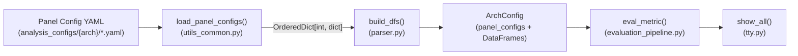
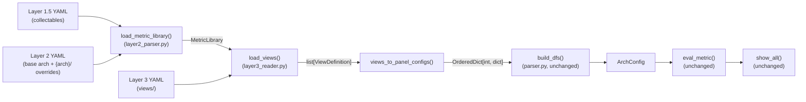
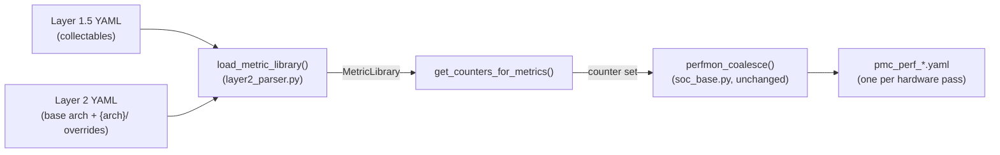
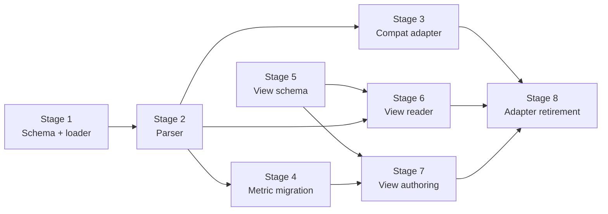

# Implement three-layer analysis config separation

## Motivation

rocprofiler-compute's analysis pipeline consumes a single monolithic `Panel Config`
YAML format. `load_panel_configs()` returns `OrderedDict[int, dict]` to `build_dfs()`,
which builds DataFrame templates with formula strings, and `eval_metric()` evaluates
them against profiled counter data. This format interleaves metric specification, display
configuration, documentation, and grouping -- every change to any concern touches files
that carry all four.

The parent HLD ([`hld-analysis-config-redesign.md`](hld-analysis-config-redesign.md))
defines a three-layer architecture to separate them. This LLD specifies how each layer
connects to the existing pipeline, how the compatibility adapter translates between old
and new formats, and what each self-contained PR delivers.

**Scope:** Layers 1.5, 2, and 3 -- collectables, metric library, display/view, and the
compatibility adapter. Layer 1 (`sdk_config.yaml`) is out of scope. The metric formula
evaluation engine (`eval_metric`, `build_eval_string`, `MetricEvaluator`) is unchanged --
only where formulas are defined and how they reach the engine changes.

Built-in variables (`$GRBM_GUI_ACTIVE_PER_XCD`, `$numActiveCUs`, etc.), currently
hardcoded in `get_build_in_vars()`, are externalized into Layer 2 YAML as part of this
work.

**Detailed design by phase:**

- [Phase 1 -- Metric Library (Stages 1-4)](lld-phase1-metric-library.md)
- [Phase 2 -- Display / View (Stages 5-8)](lld-phase2-display-view.md) -- includes
  a view consolidation plan (post Stage 7) to cut views lacking customer evidence of
  usage and co-develop useful views with customers


## Current pipeline

### Analyze mode



`load_panel_configs()` globs `*.yaml` from the arch directory, loads each via
`yaml.safe_load`, and produces an `OrderedDict` keyed by panel ID. `build_dfs()`
iterates the panel configs, builds a DataFrame per `metric_table` with formula strings
as cell values, and populates `ArchConfig.dfs`, `dfs_type`, `dfs_expressions`, and
`metric_counters`. `eval_metric()` evaluates each formula cell against the raw PMC
DataFrame and variable dicts. `show_all()` renders the evaluated DataFrames by panel
order.

### Profile mode


`detect_counters()` reads YAML files as raw text (or filters to specific sections
via `-b` / `--set`), runs `extract_counters_and_variables()` to regex-extract HW
counter names, and passes the set to `perfmon_coalesce()` which bins counters into
per-pass files respecting IP-block limits.


## Target pipeline

### Analyze mode



Everything below `OrderedDict[int, dict]` is unchanged. `build_dfs()`, `eval_metric()`,
and `show_all()` require zero modifications during the entire migration. The interface
contract is the `OrderedDict[int, dict]` shape that `build_dfs()` expects.

### Profile mode



`detect_counters()` calls `MetricLibrary.get_counters_for_metrics()` instead of
regex-scanning raw YAML text. The counter set reaches the same `perfmon_coalesce()`
path.


## Transition mechanism: legacy_id

The current pipeline -- `build_dfs()`, the `-b` filter, profiling sets -- is built
around numeric positional IDs (e.g., `11.2.3` = panel 1100, table 1102, metric index
3). The new design replaces these with stable string IDs (`compute.salu_util`). During
the transition, both systems must coexist.

`legacy_id` is an optional field on Layer 2 metrics that carries the numeric positional
ID from the current system:

```yaml
SALU Utilization:
  id: compute.salu_util          # new stable string ID
  legacy_id: "11.2.2"            # old positional ID, transition only
```

Similarly, `legacy_panel_id` on Layer 3 views carries the old numeric panel ID:

```yaml
view: "Compute Units - Compute Pipeline"
legacy_panel_id: 1100            # old panel ID, transition only
```

The compatibility adapter (Stage 3) uses these fields to reconstruct the numeric
`OrderedDict[int, dict]` that `build_dfs()` expects. The `-b` filter resolves numeric
IDs via `legacy_id` during the transition period.

Both fields are removed in Stage 8 when the old path is retired and string IDs are
the primary format. They are transition artifacts, not part of the target design.


## Stage dependencies and parallelism



| Stage | Depends on | Can run in parallel with |
|---|---|---|
| 1 -- Schema + loader | (none) | 5 |
| 2 -- Parser | 1 | 5 |
| 3 -- Compat adapter | 2 | 4, 5 |
| 4 -- Metric migration | 1, 2 (3 for validation) | 3, 5, 6 |
| 5 -- View schema | (none) | 1, 2, 3, 4 |
| 6 -- View reader | 2, 5 | 3, 4 |
| 7 -- View authoring | 4, 5 | (none -- needs migrated metrics + view schema) |
| 8 -- Adapter retirement | 3, 6, 7 | (none -- final cutover) |

**Parallelism opportunities:**

- **Stages 1 and 5** can start at the same time (no dependencies).
- **Stages 3 and 4** can run in parallel once Stage 2 lands (Stage 4 uses Stage 3
  only for golden-file validation, not as a build dependency).
- **Stage 6** can start once Stages 2 and 5 are done, overlapping with Stage 4.
- **Stage 7** is the convergence point -- it needs both metric migration (4) and
  view schema (5) before it can begin.
- **Stage 8** is the final cutover -- waits for everything.


## Risk mitigation: metric value validation

Metric values are a core product guarantee. Even unrelated refactoring can cause
breakages through typos or missed propagation.

### Validation strategy

1. **Expand `test_metric_validation.py`** with a mega-kernel test that validates
   all metric values for a given architecture, not just the 2 workloads currently
   tested (`memcopy`, `hbm_bandwidth`). This test runs on real hardware with
   exclusive GPU access -- it is not a CI test but a manually-triggered validation.

2. **Per-stage validation gate:** Before merging each implementation stage, run the
   mega-kernel validation test on at least one architecture (preferably gfx942 as
   the most widely deployed). Output must match expected values within tolerance.

3. **Golden-file comparison:** Capture the full `analyze` text output for all
   architectures before the migration begins. After each stage, compare the new
   output to the golden file. Any difference must be explained and approved.


## Metric ID transition plan

| Stage | `-b` accepts | Default | Warning |
|---|---|---|---|
| Before migration | Numeric only (`11.2.3`) | -- | -- |
| Stages 3-7 | Both numeric and string | Numeric | None |
| Stage 8 | Both numeric and string | String | Numeric produces deprecation warning |
| Post-migration (future) | String only | String | Numeric rejected |

During the transition, numeric IDs are resolved via the `legacy_id` field in
`MetricLibrary`. After Stage 8, a hardcoded final mapping handles the deprecation
window until numeric IDs are removed entirely (not in this LLD's scope).
