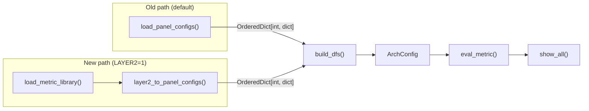

# Phase 1 -- Metric Library (Stages 1-4)

Parent: [LLD index](lld-index.md)


## Stage 1 -- Layer 1.5 collectables + Layer 2 schema + inheritance loader

### Layer 2 metric schema

New module `src/utils/layer2_schema.py`. Defines the structure of a Layer 2 metric
definition file via dataclasses.

`MetricDefinition` fields:

| Field | Type | Required | Notes |
|---|---|---|---|
| `id` | str | yes | Stable hierarchical string, e.g. `mem.l2_hit_rate` |
| `name` | str | yes | Canonical display name, e.g. `"L2 Cache Hit Rate"` |
| `formula` | str | yes | Base expression without aggregation wrappers |
| `unit` | str | yes | e.g. `"Percent"`, `"GFLOPs"` |
| `description` | str | yes | Human-readable metric description |
| `peak` | str (formula) | no | Performance ceiling expression. Required for speed-of-light metrics. |
| `coll_level` | str | no | Accumulation level, e.g. `SQ_LEVEL_WAVES` |
| `legacy_id` | str | no | Numeric positional ID for transition (see [Transition mechanism](lld-index.md#transition-mechanism-legacy_id)) |
| `archs` | list[str] | no | If absent, inherited from file scope |
| `implementations` | dict[str, str] | no | Per-family formula overrides (Case A metrics) |
| `avg_mode` | str | no | Default `weighted` (`SUM(X)/SUM(Y)`). Set to `simple` for metrics that use `AVG()` instead. |

**Aggregation is not a metric field.** The metric defines a single base formula
without aggregation wrappers (`SUM`, `AVG`, `MIN`, `MAX`). Aggregation is a display
concern owned by Layer 3 -- the view's `header` dict declares which columns to show
(e.g., `avg`, `min`, `max`, or `value`), and the code auto-generates the wrapped
formulas at evaluation time.

This eliminates the current duplication where ~98% of metrics repeat the same base
formula three times with different wrappers. The `simple_box` tables already prove
this pattern works -- they auto-generate `MIN/Q1/MEDIAN/Q3/MAX` from a single `expr`.

Percent-of-peak is not a schema field. It is computed automatically when a metric
has a `peak` formula and `unit: Percent`.

```yaml
SALU Utilization:
  id: compute.salu_util
  name: "SALU Utilization"
  formula: "100 * SQ_ACTIVE_INST_SCA / ($GRBM_GUI_ACTIVE_PER_XCD * $cu_per_gpu)"
  unit: Percent
  legacy_id: "11.2.2"
  description: >-
    The percentage of time the SALU was busy executing instructions.

VALU FLOPs:
  id: compute.valu_flops
  name: "VALU FLOPs"
  formula: "64 * (SQ_INSTS_VALU_ADD_F16 + SQ_INSTS_VALU_MUL_F16 + ...) / (End_Timestamp - Start_Timestamp)"
  unit: GFLOPs
  peak: "$max_sclk * $cu_per_gpu * 64 * 2 / 1000"
  legacy_id: "11.1.0"
  description: >-
    The total number of vector ALU floating-point operations per second.
```

**Typed variants** for fabric stall tables (`xfer`, `coherency`, `expr`, `type`,
`transaction` fields) are handled as a `FabricStallMetric` sub-schema. These table types
have fixed column structures that differ from general metric tables. The general
`MetricDefinition` does not accommodate them -- they use a separate validation path.

`VariableDefinition` fields:

| Field | Type | Required | Notes |
|---|---|---|---|
| `name` | str | yes | Variable name without `$`, e.g. `GRBM_GUI_ACTIVE_PER_XCD` |
| `formula` | str | yes | Expression, e.g. `"(GRBM_GUI_ACTIVE / $num_xcd)"` |
| `depends_on` | list[str] | no | Other variables this depends on, for eval ordering |

```yaml
# gfx908/variables.yaml
variables:
  GRBM_GUI_ACTIVE_PER_XCD:
    formula: "(GRBM_GUI_ACTIVE / $num_xcd)"
  GRBM_COUNT_PER_XCD:
    formula: "(GRBM_COUNT / $num_xcd)"
  GRBM_SPI_BUSY_PER_XCD:
    formula: "(GRBM_SPI_BUSY / $num_xcd)"
  numActiveCUs:
    formula: >-
      TO_INT(MIN(ROUND(SUM(4 * SQ_BUSY_CU_CYCLES) /
      SUM($GRBM_GUI_ACTIVE_PER_XCD), 0) / $max_waves_per_cu * 8 +
      MIN(MOD(ROUND(SUM(4 * SQ_BUSY_CU_CYCLES) /
      SUM($GRBM_GUI_ACTIVE_PER_XCD), 0),
      $max_waves_per_cu), 8), $cu_per_gpu))
    depends_on: [GRBM_GUI_ACTIVE_PER_XCD]
  kernelBusyCycles:
    formula: "ROUND(AVG((((End_Timestamp - Start_Timestamp) / 1000) * $max_sclk)), 0)"
  hbmBandwidth:
    formula: "($max_mclk / 1000 * 32 * $num_memory_channels)"
```

### Layer 1.5 -- Collectables

A collectable is a formula fragment whose counters fit in a single hardware pass. It
sits between raw PMC counters (Layer 1) and full metric formulas (Layer 2) in the
layer hierarchy.

#### The hardware constraint

Each IP block has a per-pass counter limit enforced by the hardware. On gfx942:

| IP Block | Max counters per pass |
|---|---|
| SQ | 8 (includes SQC and SP via BLOCK_REMAP) |
| TCC | 4 |
| TCP | 4 |
| TA | 2 |
| TD | 2 |
| GRBM | 2 |

Metric formulas routinely exceed these limits:

- **VALU FLOPs** (single metric): references 12 SQ counters (`SQ_INSTS_VALU_ADD_F16`,
  `SQ_INSTS_VALU_MUL_F16`, ..., `SQ_INSTS_VALU_FMA_F64`). SQ limit is 8 -- this one
  metric must span at least 2 hardware passes.
- **System Speed-of-Light panel**: ~39 SQ/SQC counters total -> 5+ SQ-limited passes.
- **L2 Cache panel**: 32 TCC counters / 4 per pass = 8+ TCC-limited passes.
- **vL1D Cache panel**: 34 TCP counters / 4 per pass = 9+ TCP-limited passes.

The current system handles this by binning counters across passes via
`perfmon_coalesce()`, then evaluating the full formula against merged counter data
from all passes. This produces incorrect results for ratio metrics.

#### Why cross-pass evaluation is mathematically wrong

**Concrete example: L2 Cache Hit Rate on gfx942**

Formula: `100 * TCC_HIT_sum / (TCC_HIT_sum + TCC_MISS_sum)`

The invariant: in any single kernel execution, `TCC_HIT + TCC_MISS = total requests`,
so `0% <= HitRate <= 100%`.

Suppose TCC_HIT_sum and TCC_MISS_sum land in different passes (TCC limit = 4 counters,
and other TCC counters consumed the remaining slots). Consider a GEMM kernel touching
a large matrix:

| | TCC_HIT | TCC_MISS | True hit rate |
|---|---|---|---|
| Pass 1 (cache cold at start) | 500,000 | 300,000 | 62.5% |
| Pass 2 (cache warm from pass 1) | 750,000 | 50,000 | 93.75% |

The cross-pass formula uses TCC_HIT from pass 1 and TCC_MISS from pass 2:

```
HitRate_cross = 100 * 500,000 / (500,000 + 50,000) = 90.9%
```

This result (90.9%) is neither the pass-1 truth (62.5%) nor the pass-2 truth (93.75%).
It describes no actual kernel execution.

**Formal statement:** Let H(i) and M(i) be hit and miss counts in pass i. The true
hit rate for pass i is R(i) = H(i) / (H(i) + M(i)). Cross-pass collection computes:

```
R_cross = H(1) / (H(1) + M(2))
```

R_cross = R(1) only when M(2) = M(1), i.e., when the workload is perfectly
deterministic across passes. For any workload with state-dependent behavior (cache
warming, OS scheduling jitter, memory allocation differences), M(2) != M(1) and
the error is:

```
|R_cross - R(1)| = |H(1) * (M(1) - M(2))| / ((H(1) + M(1)) * (H(1) + M(2)))
```

**Pathological case:** For the TCP hit rate formula `100 * (REQ - MISS) / REQ`: if
REQ is measured in pass 1 (low-traffic phase, REQ = 1000) and MISS in pass 2
(high-traffic phase, MISS = 2000), the result is `100 * (1000 - 2000) / 1000 = -100%`
-- a physically impossible value.

#### Existing partial mechanisms

| Mechanism | What it does | Why it is insufficient |
|---|---|---|
| `same_bucket_priority_metric_ids` | Greedy bin-packing that tries to keep priority metrics' counters in one pass | Falls through silently when counters don't fit; only 4 metrics configured (gfx115x only) |
| `_metric_aware_coalesce_pass` | Best-effort: sorts metrics by counter count, tries to pack each metric's counters into one bucket | No guarantee; logs a debug message and defers to first-fit when it fails |
| `coll_level` | Marks accumulator counters that need dedicated pass files | Only for ACCUM counters, not for general ratio metrics |
| `NOISE_CLAMP` | Display-time clamp that suppresses results with high noise indicators | Mitigation, not prevention -- the wrong value is still computed |

#### What a collectable formalizes

A collectable declares a set of counters that form an **atomic collection unit** --
they must be collected in the same hardware pass to produce a mathematically correct
intermediate result.

```yaml
# gfx908/collectables.yaml
collectables:
  l2_hit_miss:
    id: collect.l2_hit_miss
    formula: "TCC_HIT_sum / (TCC_HIT_sum + TCC_MISS_sum)"
    # counters: [TCC_HIT_sum, TCC_MISS_sum]  -- inferred from formula
```

A Layer 2 metric can reference a collectable by id:

```yaml
L2 Cache Hit Rate:
  id: mem.l2_hit_rate
  name: "L2 Cache Hit Rate"
  formula: "100 * $collect.l2_hit_miss"
  unit: Percent
  peak: 100
  description: >-
    The ratio of cache line requests that hit in the last-level on-chip cache.
```

#### Scope in this LLD

This stage defines the collectable **schema and config structure** so that
collectables have a well-defined home in the layer architecture. Layer 2 metrics can
reference collectables by id in their formulas. During counter extraction,
`get_counters_for_metrics()` resolves collectables transitively to their underlying
Layer 1 counters.

The evaluation pipeline (`eval_metric()`, `build_eval_string()`, `MetricEvaluator`)
is not changed in this LLD. Currently, collectables expand inline like built-in
variables -- they are a formula organization mechanism. Per-pass intermediate
evaluation (collecting a collectable's counters together and evaluating its formula
within that pass) is a future enhancement requiring a separate design.

The bin-packing pipeline (`perfmon_coalesce()`) is not changed. Collectable-aware
counter grouping is a natural follow-up once per-pass evaluation is implemented.

`CollectableDefinition` fields:

| Field | Type | Required | Notes |
|---|---|---|---|
| `id` | str | yes | Stable string, e.g. `collect.l2_hit_miss` |
| `formula` | str | yes | References Layer 1 counters only |
| `counters` | list[str] | no | Explicit counter list for pass-limit validation (inferred from formula if absent) |

The `MetricLibrary` (Stage 2) loads collectables from `collectables.yaml` alongside
metrics and variables. `get_counters_for_metrics()` resolves collectable references
in the same way it resolves built-in variables -- transitively extracting the
underlying Layer 1 counters from the collectable's formula.

**Target state for SDK integration:** The HLD notes that collectables should
ultimately be integrated into `sdk_config.yaml` as part of the SDK counter
definitions. This requires collaboration with the SDK team and is not part of this
LLD. Until then, collectables are defined separately by rocprof-compute in the
base arch YAML files.

### Inheritance loader

New module `src/utils/yaml_inherit_loader.py`. Implements a custom PyYAML loader
for the `!inherit <path>` tag. The tag must appear as the first line of a YAML file.

GitLab CI's `extends` keyword uses the same approach -- deep merge across files,
multi-level inheritance, later values override earlier ones.
See [GitLab YAML optimization docs](https://docs.gitlab.com/ci/yaml/yaml_optimization/).
Native YAML anchors (`&`/`*`) and merge keys (`<<`) are insufficient -- they only
perform shallow merge, do not work across files, and the merge key is semi-deprecated
in the YAML spec.

**Implementation:** Vendor the [`deepmerge`](https://pypi.org/project/deepmerge/)
Python library (pure Python, MIT license) or implement the merge logic inline
(~30 lines for our specific merge rules). The merge must work in profile mode,
which prohibits pip dependencies (`ProfileModeImportGuard` enforces stdlib-only
imports). The vendored PyYAML is precedent for this approach. Import yaml from
the vendored copy (`from vendored import yaml`) for profile-mode compatibility.

`InheritLoader` subclasses `yaml.SafeLoader` and registers constructors for two
custom tags:
- `!inherit <path>` -- file-level inheritance (loads and merges the referenced file)
- `!remove` -- marks a key for deletion during merge

When `!inherit` fires:

1. Resolve `<path>` relative to the current file's directory.
2. Load the base file recursively (supporting chains:
   `gfx950 -> gfx942 -> gfx940 -> gfx90a -> gfx908`).
3. Deep-merge the current file's content on top of the base.
4. After merge, scan for any `!remove` markers and delete those keys.

**Merge operations:**

| Operation | Input | Behavior |
|---|---|---|
| Modify | Scalar in override | Override replaces base value. |
| Add | New key in override | Appended to the merged map. Supports adding new metrics, tables, or fields that the parent arch does not have. |
| Remove | Value set to `!remove` | Key is deleted from the merged result. Used when a child arch drops a metric or field that existed in the parent. |
| Deep merge | Map + map | Recursive deep merge. Override keys win; base-only keys preserved. |
| List merge | `data source` list | Matched by `metric_table.id` (not position), then deep-merged per entry. New entries appended. |

Example of all three operations:

```yaml
# gfx90a/0200_system_speed_of_light.yaml
!inherit ../gfx908/0200_system_speed_of_light.yaml

metric:
  # Modify: change the formula for an existing metric
  VALU FLOPs:
    formula: "64 * (SQ_INSTS_VALU_ADD_F16 + ...) / (End_Timestamp - Start_Timestamp)"

  # Add: new metric not present in gfx908
  MFMA FLOPs (BF16):
    id: compute.mfma_flops_bf16
    name: "MFMA FLOPs (BF16)"
    formula: "512 * SQ_INSTS_VALU_MFMA_MOPS_BF16 / (End_Timestamp - Start_Timestamp)"
    unit: GFLOPs
    description: >-
      BF16 matrix fused multiply-add operations per second.

  # Remove: metric that existed in gfx908 but is not valid for gfx90a
  Some Deprecated Metric: !remove
```

**Cycle detection:** Maintain a set of resolved absolute paths during the recursive
chain. If a path appears twice, raise `InheritanceCycleError` with the full chain.

**Why env var for feature flag:** The transition flag (`ROCPROF_COMPUTE_LAYER2`)
uses an environment variable rather than the project's `--experimental` argparse
pattern because it is a temporary internal implementation switch (not a user feature)
that must work in both profile and analyze code paths without threading through the
argparse namespace.

### Tests

- Schema validation: required fields produce valid objects, missing required fields
  raise validation errors, typed variant fields accepted only for fabric stall metrics.
- Collectable schema: valid collectable definitions pass validation, missing `id` or
  `formula` raises errors, counter list is inferred from formula when not explicit.
- Inheritance loader: single-level inheritance, multi-level chain (4+ deep, matching
  the real `gfx908 -> gfx90a -> gfx940 -> gfx942` chain), cycle detection error.
- Merge operations: key modification (override), key addition (new metric in child),
  key removal (`!remove` deletes from merged result), deep-merge of maps,
  `data source` list matched by `metric_table.id`, new list entry appended.
- Round-trip: a minimal synthetic YAML family (base + chain of overrides with
  additions, modifications, and removals) loads correctly and produces the expected
  merged structure.
- Golden-file comparison infrastructure: note this is a new testing pattern for the
  project. The test framework for serializing and comparing `panel_configs` output
  needs to be built as part of this stage.

### Dependencies

None. This is the foundation stage.


## Stage 2 -- Layer 2 parser

### MetricLibrary

New module `src/utils/layer2_parser.py`.

`load_metric_library(metric_dir: Path, arch: str) -> MetricLibrary`:

1. Resolve the architecture's base arch and inheritance chain:
   ```python
   ARCH_INHERITANCE = {
       "gfx908": None,         # CDNA base -- no parent
       "gfx90a": "gfx908",
       "gfx940": "gfx90a",     # each arch inherits from its immediate predecessor
       "gfx941": "gfx940",
       "gfx942": "gfx940",
       "gfx950": "gfx942",
       "gfx115x": None,        # RDNA base -- no parent
   }
   ```
2. Load YAML files from `{metric_dir}/{arch}/`. Each file either stands alone (base
   arch) or begins with `!inherit` pointing to the parent arch's file.
3. The `InheritLoader` (Stage 1) resolves the `!inherit` chain recursively and
   deep-merges overrides on top of the base.
4. Validate each loaded metric definition against `layer2_schema`.
5. Collect all metrics into `MetricLibrary.metrics: dict[str, MetricDefinition]`,
   keyed by string `id`. Raise on duplicate ids.
6. Load `variables.yaml` from the base arch directory (walked via `ARCH_INHERITANCE`)
   into `MetricLibrary.variables: dict[str, VariableDefinition]`.
7. Load `collectables.yaml` from the base arch directory into
   `MetricLibrary.collectables: dict[str, CollectableDefinition]`.
8. Load the sets file (`profile_configs/sets/{arch}_sets.yaml`) into
   `MetricLibrary.sets: dict[str, SetDefinition]`.

`MetricLibrary` class:

```python
class MetricLibrary:
    metrics: dict[str, MetricDefinition]
    variables: dict[str, VariableDefinition]
    collectables: dict[str, CollectableDefinition]
    sets: dict[str, SetDefinition]

    def get_metric(self, id: str) -> MetricDefinition: ...
    def get_counters_for_metrics(
        self, metric_ids: list[str], gpu_series: str
    ) -> set[str]: ...
```

`get_counters_for_metrics()` extracts HW counters from the requested metrics:

1. **Pre-expand collectable references:** Replace `$collect.xxx` in formulas with the
   collectable's own formula before passing to the regex extractor. This is necessary
   because `VARIABLE_RE` in `utils_counter_defs.py` stops at the dot -- `$collect.l2_hit_miss`
   would be parsed as variable `collect` + stray text `.l2_hit_miss`.
2. **Concatenate formula strings** for the requested metrics (including expanded
   collectables).
3. **Include `coll_level` values** in the text passed to the extractor. The current
   `detect_counters()` scans raw YAML text which incidentally picks up
   `coll_level: SQ_LEVEL_WAVES` as a counter name. The MetricLibrary approach must
   explicitly add `coll_level` values to maintain equivalence.
4. **Delegate to `extract_counters_and_variables()`** in `utils_counter_defs.py` for
   regex-based HW counter extraction and transitive built-in variable resolution.

### Tests

- Integration test: load a synthetic family chain (`gfx908/` -> `gfx940/` ->
  `gfx942/`) from test fixtures. Verify: correct number of metrics, inheritance
  overrides applied, variable definitions present, duplicate id raises error.
- Counter extraction equivalence: `get_counters_for_metrics()` returns the same
  counter set as `extract_counters_and_variables()` when given the same formula text.
- String metric IDs follow the hierarchical convention
  (`{category}.{subcategory}_{name}`).

### Dependencies

Stage 1.


## Stage 3 -- Compatibility adapter

This is the critical integration piece. The adapter sits between the new Layer 2 output
and the existing pipeline. It produces exactly the same `panel_configs` structure that
`load_panel_configs()` returns today so that `build_dfs()`, `eval_metric()`, and
`show_all()` require zero changes.

### Adapter

New module `src/utils/compat_adapter.py`.

`layer2_to_panel_configs(library: MetricLibrary, arch: str) -> OrderedDict[int, dict]`:

The output must match the exact dict shape that `_build_metric_table_df()` in
`parser.py` consumes:

```python
{
    panel_id: {
        "id": int,           # e.g. 1100
        "title": str,        # e.g. "Compute Units - Compute Pipeline"
        "data source": [
            {"metric_table": {
                "id": int,     # e.g. 1101
                "title": str,
                "header": {"metric": str, "value"|"avg": str, ...},
                "metric": OrderedDict({
                    "VALU FLOPs": {"value": "formula...", "unit": "GFLOPs", ...},
                    ...
                }),
                "cli_style": str,  # optional
            }},
        ],
        "metrics_description": {"VALU FLOPs": "description...", ...},
    }
}
```

The adapter reconstructs this shape from `MetricLibrary` by:

1. Grouping metrics by their `legacy_id` prefix. E.g., metrics with `legacy_id`
   `"11.1.0"`, `"11.1.1"`, ... belong to panel 1100, table 1101. The `legacy_id`
   field is the bridge between string ids and the numeric structure.
2. Building the `header` dict from the table's column layout (determined by the
   view in the final design, or from a legacy mapping during transition).
3. Building the `metric` OrderedDict with metric name as key and formula fields as
   value dict. During the initial migration (Stage 4), the migration tooling
   pre-computes the aggregation-wrapped formulas (avg/min/max) from the base formula
   and stores them alongside the base formula. The adapter reads these pre-computed
   values rather than generating them at runtime. Runtime auto-generation of
   aggregation wrappers is a future optimization (the wrapping logic is more complex
   than a simple prefix/suffix -- it involves constant factoring, numerator/denominator
   decomposition, and handling of inner functions like NOISE_CLAMP).
4. Computing percent-of-peak automatically for metrics with both `peak` and
   `unit: Percent`.
5. Placing descriptions into `metrics_description`.

`layer2_vars_to_builtin_vars(library: MetricLibrary) -> dict[str, str]`:

Converts `MetricLibrary.variables` to the `dict[str, str]` format that
`get_build_in_vars()` returns (variable name -> formula string). This allows
`calc_builtin_vars()` in `evaluation_pipeline.py` to use variables from YAML
without changing its evaluation logic.

### Integration point

`generate_configs()` in `analysis_base.py` is the single switching point. A feature
flag (`ROCPROF_COMPUTE_LAYER2` environment variable) selects the path:

```python
# In generate_configs(), replacing line 176:
if os.environ.get("ROCPROF_COMPUTE_LAYER2"):
    library = load_metric_library(Path(config_dir), arch)
    ac.panel_configs = layer2_to_panel_configs(library, arch)
else:
    ac.panel_configs = load_panel_configs(arch_panel_config)
```

Everything downstream -- `build_dfs()`, `eval_metric()`, `show_all()` -- sees the
same `ArchConfig` regardless of which path produced it.



### Profile mode integration

`detect_counters()` in `soc_base.py` -- add a feature-flagged branch:

```python
if os.environ.get("ROCPROF_COMPUTE_LAYER2"):
    library = load_metric_library(Path(config_dir), arch)
    if filter_blocks:
        # Resolve filter tokens to metric ids
        metric_ids = resolve_filter_to_metric_ids(filter_blocks, library)
        counters = library.get_counters_for_metrics(metric_ids, gpu_series)
    else:
        all_ids = list(library.metrics.keys())
        counters = library.get_counters_for_metrics(all_ids, gpu_series)
```

### Validation

- **Golden-file test:** For each architecture, produce `panel_configs` via both old
  and new paths, serialize to JSON, assert structural equality.
- **Counter extraction equivalence:** `detect_counters()` returns the same counter
  set via both paths.
- **End-to-end:** Full analyze pipeline (load -> build_dfs -> eval_metric -> show_all)
  with the Layer 2 path produces identical text output to the old path for a
  reference workload.

### Dependencies

Stage 2.


## Stage 4 -- Metric and set migration

The largest stage. Parallelizable by hardware concept (compute, memory, system, sets)
and by architecture. The deliverable is the actual Layer 2 YAML files and the migration
of built-in variables and sets.

### New directory structure

```
analysis_configs/
  gfx908/              # CDNA base (first arch) -- complete standalone definitions
    variables.yaml
    collectables.yaml
    0200_system_speed_of_light.yaml
    0400_roofline.yaml
    0600_command_processor.yaml
    0700_wavefront.yaml
    0800_shader_processor_input.yaml
    1000_ta_td.yaml
    1100_compute_units_compute_pipeline.yaml
    1200_local_data_share_lds.yaml
    1400_l1_address_processing.yaml
    1500_l1_data_cache.yaml
    1600_l1_cache.yaml
    1700_l2_cache.yaml
    1800_l2_cache_per_channel.yaml
    1900_l2_fabric_interface.yaml
    2100_fabric_stall.yaml
    2200_fabric_stall_2.yaml
  gfx90a/              # inherits gfx908, overrides only what differs
  gfx940/              # inherits gfx90a
  gfx941/              # inherits gfx940 (1 file diff)
  gfx942/              # inherits gfx940
  gfx950/              # inherits gfx942
  gfx115x/             # RDNA base -- complete standalone definitions
    variables.yaml
    collectables.yaml
    ... (RDNA panel files)
  views/               # (Stage 7)
```

No abstract `_base/` directories. The first architecture in each family (gfx908 for
CDNA, gfx115x for RDNA) serves as the base -- its files are complete, standalone
definitions. Each subsequent arch inherits from its immediate predecessor in the
hardware lineage, using additions, modifications, and removals (`!remove`) to
express only what changed. This chain-based pattern applies to future families
(gfx12xx).

### Migration order

1. **gfx908** -- the CDNA base. Convert its current panel config files to Layer 2
   format with string IDs, single formulas, and descriptions. This is the largest
   single-arch conversion but produces the foundation for the inheritance chain.
2. **gfx90a** -- inherits gfx908. Override files for metrics added or modified in MI200.
3. **gfx940** -- inherits gfx90a. MI300 generation -- adds MFMA FLOPs variants,
   modifies formulas for new counter names.
4. **gfx941** -- inherits gfx940. Differs in exactly 1 file (unit override). The
   smallest possible override, ideal for validating the inheritance mechanism.
5. **gfx942, gfx950** -- inherits gfx940/gfx942 respectively.
6. **gfx115x** -- RDNA base. Separate standalone definitions, no inheritance from CDNA.

Each step is validated: run the golden-file comparison (old path vs new path) for the
migrated architecture before proceeding to the next.

### Metric ID assignment

Convention: `{category}.{subcategory}_{name}`, all lowercase, underscores for
word separation.

| Category | Derived from | Example IDs |
|---|---|---|
| `system` | Panel 0200 | `system.gpu_util`, `system.gpu_busy` |
| `roofline` | Panel 0400 | `roofline.hbm_bw`, `roofline.l2_bw` |
| `compute` | Panel 1100 | `compute.valu_flops`, `compute.salu_util`, `compute.ipc` |
| `wavefront` | Panel 0700 | `wavefront.occupancy`, `wavefront.vgprs` |
| `lds` | Panel 1200 | `lds.util`, `lds.bank_conflicts` |
| `mem.l1i` | Panel 1600 | `mem.l1i_fetch_hit_rate` |
| `mem.l1d` | Panel 1500 | `mem.l1d_cache_bw`, `mem.l1d_hit_rate` |
| `mem.l2` | Panel 1700 | `mem.l2_hit_rate`, `mem.l2_cache_bw` |
| `mem.fabric` | Panel 1900-2200 | `mem.fabric_rd_lat`, `mem.fabric_stall_rd` |
| `cp` | Panel 0600 | `cp.load_util`, `cp.stall` |
| `spi` | Panel 0800 | `spi.shader_processor_util` |

The `legacy_id` field preserves the numeric mapping (e.g., `legacy_id: "11.2.2"`)
for the compatibility adapter. It is removed in Stage 8.

### OQ3 resolution -- 39 metrics with both description and formula drift

These metrics cannot be automatically classified as Case A (same metric, different
implementations) or Case B (separate metrics). Each requires manual review.

**Classification criteria:**

- **Case A** -- the metric measures the same hardware concept across architectures,
  but uses different counters or formulas because the hardware implementation changed.
  The semantic intent is identical. Test: a domain expert would compare these values
  across architectures in a baseline comparison and the comparison would be meaningful.

- **Case B** -- the formula change reflects a fundamentally different measurement,
  not just a hardware implementation difference. Test: comparing these values across
  architectures would be misleading or meaningless.

**Decision workflow:**

1. For each of the 39 metrics, produce a side-by-side table:

   | Metric | Arch | Formula | Description |
   |---|---|---|---|
   | `VALU FLOPs` | gfx908 | `64 * SUM(SQ_INSTS_VALU_*) / ...` | *"Vector ALU ..."* |
   | `VALU FLOPs` | gfx942 | `64 * SUM(SQ_INSTS_VALU_*) / ...` | *"Vector ALU ..."* |
   | `VALU FLOPs` | gfx115x | `64 * SUM(SQ_INSTS_VALU_*) / ...` | *"Vector ALU ..."* |

2. A domain expert marks each as A or B.
3. **Case A:** one `id` (e.g., `compute.valu_flops`), with per-family formula overrides
   in the `implementations:` block. The description is the canonical (most complete) one.
4. **Case B:** separate `id`s (e.g., `compute.valu_flops_cdna`, `compute.valu_flops_rdna`).

The 39 metrics are listed in
[`hld-metric-analysis-2026-07-13.md`, Step 2](hld-metric-analysis-2026-07-13.md).
Examples: `VALU FLOPs`, `MFMA FLOPs (BF16)`, `MFMA FLOPs (F16)`.

### OQ4 resolution -- 43 same-description-different-name cases

These are metrics where the same description appears under multiple display names
across architectures.

**Resolution criteria:**

1. Select the **most specific, unambiguous name** as the canonical `name` in Layer 2.
   Prefer names that self-document the metric's scope without being excessively verbose.
2. All other names become view-level `label` overrides in Layer 3.

| Description group | Current names | Canonical `name` |
|---|---|---|
| L2 cache hit ratio | `Cache Hit`, `Hit Rate`, `L2 Cache Hit Rate`, `L2 Hit` | `L2 Cache Hit Rate` |
| Read latency | `Fabric Rd Lat`, `L2-Fabric Read Latency`, `Read Latency` | `L2-Fabric Read Latency` |
| INT8 MFMA ops | `MFMA IOPs (INT8)`, `MFMA IOPs (Int8)` | `MFMA IOPs (INT8)` |

The full list of 43 groups is in
[`hld-metric-analysis-2026-07-13.md`, Step 3](hld-metric-analysis-2026-07-13.md).

### Sets migration

Convert `profile_configs/sets/{arch}_sets.yaml` from numeric positional IDs to string
metric IDs:

```yaml
# Before
sets:
- title: Compute Throughput Utilization
  set_option: compute_thruput_util
  description: Placeholder
  metric:
  - 11.2.2: SALU Utilization
  - 11.2.3: VALU Utilization

# After
sets:
- title: Compute Throughput Utilization
  set_option: compute_thruput_util
  description: Placeholder
  metric:
  - compute.salu_util: SALU Utilization
  - compute.valu_util: VALU Utilization
```

During transition, `parse_sets_yaml()` in `utils_common.py` accepts both numeric
and string IDs. The validation pre-commit hook (`validate_sets_metric_ids.py`) resolves
string IDs via `MetricLibrary` instead of positional index lookup.

### Built-in variable migration

`get_build_in_vars()` in `utils_counter_defs.py` becomes a wrapper:

```python
def get_build_in_vars(gpu_series: str) -> dict[str, str]:
    if os.environ.get("ROCPROF_COMPUTE_LAYER2"):
        # Load from MetricLibrary (populated from base arch variables.yaml)
        return _load_vars_from_layer2(gpu_series)
    # Fall back to hardcoded dict (existing behavior)
    ...
```

The evaluation pipeline (`calc_builtin_vars()` in `evaluation_pipeline.py`) is
unchanged -- it receives the same `dict[str, str]` regardless of source.

### Tooling updates

| Tool | What changes |
|---|---|
| `validate_sets_metric_ids.py` | Accept string metric IDs. Validate against `MetricLibrary` when Layer 2 active, positional index when not. |
| `format_yaml.py` | Recognize Layer 2 YAML structure (metric list with `id`, `name`, aggregation fields). Core equation formatting logic (factoring constants out of aggregation) is unchanged -- same equation keys (`value`, `avg`, `min`, `max`, `peak`). |
| `hash_manager.py` | Include base arch directories in hash database. Path discovery expands to cover `gfx908/*.yaml` and `gfx115x/*.yaml` as base arch files. |
| `verify_against_config_template.py` | Validate Layer 2 files against `layer2_schema.py` instead of the Panel Config template. During transition, both templates checked depending on file location. |
| `metric_description_manager.py` | Read descriptions from Layer 2 definitions (co-located with `id`). Output format for docs YAMLs is unchanged. |

### Migration tooling

One-time script `tools/migrate_to_layer2.py`:

1. Read each current panel config YAML for a given architecture.
2. For each metric: generate the Layer 2 format with string `id`, canonical `name`,
   `unit`, aggregation fields, `description`, and `legacy_id`.
3. Flag metrics in the OQ3/OQ4 lists for manual review.
4. Generate the family base files and arch override files.
5. Validate round-trip: run `layer2_to_panel_configs()` on the generated files and
   compare output to the original `load_panel_configs()` result.

### Validation

- Per-arch golden-file comparison: old path vs new path, for analyze output.
- Variable equivalence: variables from YAML produce the same evaluation results as
  the hardcoded `get_build_in_vars()`.
- Counter extraction equivalence: `detect_counters()` via Layer 2 path returns the
  same counter set.
- Pre-commit hook: `validate_sets_metric_ids.py` passes with new sets format.

### Dependencies

Stages 1, 2. Stage 3 needed for validation (golden-file comparison).
