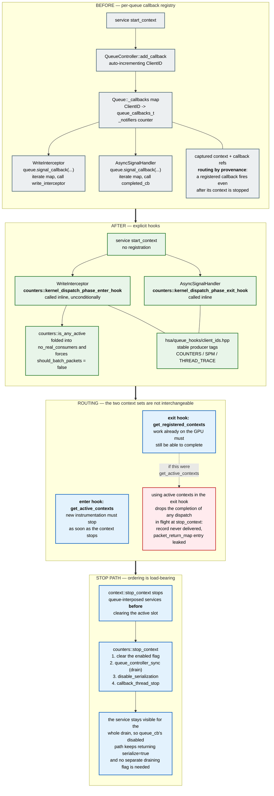

# Queue Callback Registry Removal — Software Architecture

How queue-interposed services are wired into dispatch interception after the per-queue callback
registry is removed, why completion routing and enqueue routing deliberately use different context
sets, and why `stop_context` drains the GPU.

Paths are relative to `projects/rocprofiler-sdk/source/`. Symbols are named rather than cited by
line number, since line numbers rot faster than the code they point at.

The migration is one PR per service. Counter collection (#8891) introduces the shared
`hsa/queue_hooks/` infrastructure that the rest build on; SPM (#8887), thread trace (#8790) and PC
sampling (#8895) follow the same shape. This document describes the mechanism as a whole, and flags
which service each part currently lives on.

## 1. Diagram

## 2. What the migration changes

Before, a service registered a `queue_callbacks_t` pair with the queue controller when its context
started. The write interceptor and the async signal handler both walked `Queue::_callbacks` and
invoked whatever was registered, and `Queue::get_notifiers()` counted the registrations so the
interceptor could early-out when nothing was subscribed.

After, the service registers nothing. The write interceptor and the async signal handler call the
service's hooks directly, and each hook decides for itself whether it has work to do by querying the
context list.

For counter collection:

| Element | Location |
|---|---|
| `counters::kernel_dispatch_phase_enter_hook` | `counters/queue_hooks.hpp`, `counters/queue_hooks.cpp` |
| `counters::kernel_dispatch_phase_exit_hook` | `counters/queue_hooks.hpp`, `counters/queue_hooks.cpp` |
| `counters::is_any_active` | `counters/queue_hooks.hpp`, `counters/queue_hooks.cpp` |
| Context filter shared by all three | `counters/queue_hooks.cpp`, `counter_contexts_filter()` |
| Stable producer tags | `hsa/queue_hooks/client_ids.hpp` |
| Exit hook call site | `hsa/queue.cpp`, in the async signal handler |
| `no_real_consumers` gains `!counters::is_any_active()` | `hsa/queue.cpp` |
| Enter hook call site | `hsa/queue.cpp`, in the write interceptor |
| Batching disabled while counters are active | `hsa/queue.cpp`, `should_batch_packets` |
| Service stop path | `counters/core.cpp`, `stop_context()` |

The hook names describe the dispatch phase they run in: the enter hook runs when a dispatch is being
submitted, the exit hook when its completion signal fires. `is_any_active` is neither phase, so it
keeps a plain name. Each remaining service mirrors this trio in its own `queue_hooks.{hpp,cpp}`.

`client_ids.hpp` replaces the registry's auto-incrementing `ClientID` with fixed producer tags, so
the id attached to an instrumentation packet no longer depends on the order in which services
happened to register. The tags numerically overlap the registry's `ClientID`, which also starts at 1
and remains in use by services that have not migrated yet. That is inert only because no consumer
dispatches on the tag — each service identifies its own packets by pointer lookup or `dynamic_cast`
— and `client_ids.hpp` records what has to change before anything routes on these values.

## 3. Enqueue and completion use different context sets

This is the central design point, and getting it wrong is a silent data-loss bug rather than a crash.

The registry routed completions by **provenance**: the callback pair captured at enqueue time was
invoked when the packet completed, regardless of whether the owning context was still active. The
hooks have to reproduce that property without the registry, and they do it by choosing different
context sets for the two phases:

- The **enter hook** iterates `get_active_contexts`. New instrumentation must stop being added as
  soon as the context stops.
- The **exit hook** iterates `get_registered_contexts`. A dispatch already executing on the GPU must
  still be able to deliver its record, even though its context is no longer active.

Routing the exit hook over active contexts instead loses any dispatch that is in flight when its
context is stopped: `completed_cb` never runs, so the record is never delivered to the tool, and the
`packet_return_map` entry is never erased, leaking the AQL packet and its profile allocation. Because
pause/resume is implemented as `stop_context`/`start_context`, this shows up as missing counter
records around every pause.

Iterating registered contexts is safe because `completed_cb` self-filters: it resolves ownership by
looking the packet up in its own context's `packet_return_map` and returns early for packets it does
not own. Each context therefore still processes only its own packets, and the guarantee is restored
without reintroducing a registry.

## 4. The stop path

Two orderings matter, both stated at their call sites in the code.

**`context::stop_context` stops queue-interposed services before clearing the active slot.** Counter
collection, SPM, device thread trace and dispatch thread trace are all stopped ahead of the
`compare_exchange_strong` that nulls the context's active slot. Clearing the slot first opens a
window in which the enter hook sees no active context, so a dispatch is submitted without serializer
packets while the serializer is still enabled.

**`counters::stop_context` drains the GPU before disabling serialization.** The order is: clear the
service's `enabled` flag, `hsa::queue_controller_sync()`, `disable_serialization()`, then
`callback_thread_stop()`.

### 4.1 Why the drain is kept

Provenance routing and the drain answer different questions, so one does not replace the other.
Provenance routing guarantees that a completion which *arrives* is delivered. The drain bounds
*when completions arrive at all*, which is what the teardown downstream of it depends on: it is what
makes "the callback thread and the `counter_callback_info` objects outlive every in-flight dispatch"
true literally, rather than true by an argument about what happens if they do not.

The supporting facts are worth recording, because they are the reason a missing drain is hard to
notice rather than a reason to omit it:

| Property | Why it holds |
|---|---|
| `counter_callback_info` lifetime | Structural. The context holds them as `std::vector<std::shared_ptr<...>>` on the service, and neither `counters::stop_context` nor `context::stop_context` clears that vector. Since the exit hook iterates *registered* contexts, the context and its callbacks are still reachable. |
| Callback thread does not strand queued work | `consumer_thread_t::exit()` clears `valid` then waits on `exited`, and `consumer_loop` only sets `exited` once `read_ptr == write_ptr`, so the queue drains before the join. Afterwards `consumer_thread_t::add()` takes the self-consume path and runs inline on the caller. Covered by `counters/tests/consumer_test.cpp`, `restart`. |
| Serializer transition with in-flight serialized dispatches | GPU-ordered independently. `profiler_serializer::disable()` records the previous state and pushes an `hsa_barrier` across the queues, and `kernel_completion_signal` reconciles in-flight dispatches against it. |
| No separate "draining" flag is needed | `context::stop_context` calls the service stop path while the context is still in the active list, so throughout the drain the enter hook still reaches `queue_cb`, whose disabled path returns `serialize=true` and keeps the serialized-to-unserialized transition coordinated. This only works because the drain happens before the slot is cleared. |

The drain is a bound, not a hard barrier: `Queue::sync` uses a five-second hint and only warns on
timeout, and `_active_kernels` counts intercepted dispatches only. It is the ordering guarantee for
teardown, and provenance routing in the exit hook is what makes individual completions correct.

One hazard is not covered by either mechanism: the drain incidentally protects the sequence "stop the
context, then destroy the counter config". If a tool does that, the guard belongs at the destroy
path as a drain or a refcount, since that is where the lifetime actually ends.

## 5. Relationship to kernel replay (#8622)

Callback removal is a soft prerequisite for kernel replay, not a blocker, and the two can land in
either order.

It helps because with the registry there is no explicit "if this context is active" block in the
write interceptor — the decision is hidden inside the registered callbacks, so disabling a service
for a single replay pass means mutating the callback structure. Once the hooks are inline, the
interceptor has an explicit conditional on context activity, which is a much easier place to express
that a context is active globally but inactive for this pass.

The routing rule in section 3 matters more under replay than without it. Replay runs N passes per
dispatch and reuses `process_packet_batch` for each pass, so every pass creates its own
instrumentation packet and its own `packet_return_map` entry. A dropped completion is one lost record
without replay; under replay it is N leaked packets per dispatch plus silently missing counter
groups. The replay loop also waits on its `pass_done` barrier with no timeout, so a stall on the
completion path becomes an application hang rather than data loss.

## 6. Known gaps

1. Thread trace, PC sampling and device counter collection still use the registry, so
   `Queue::_callbacks`, `Queue::get_notifiers()` and `QueueController::add_callback` cannot be
   deleted yet. `client_ids.hpp` already reserves tags for thread trace and PC sampling.
2. Several in-flight PRs edit the same `no_real_consumers` expression in `hsa/queue.cpp`.
   Consolidating the predicate into one `needs_interception(queue)` helper would remove the
   recurring conflict.
3. `counters::is_any_active()` forces `should_batch_packets = false` for every dispatch while any
   counter context is active. The performance effect of that, combined with kernel replay's own
   gate, has not been measured.
